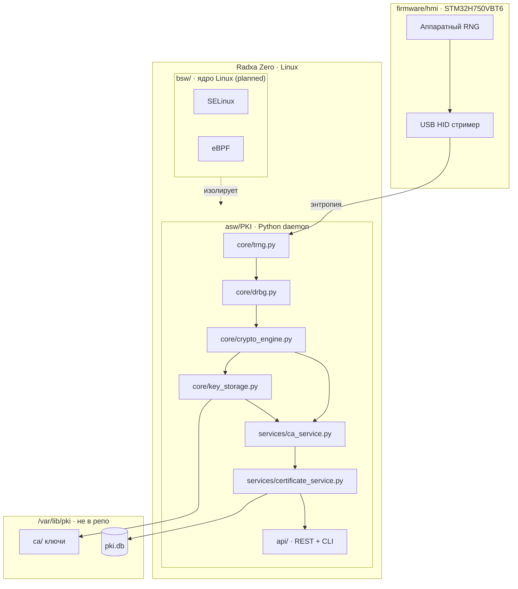
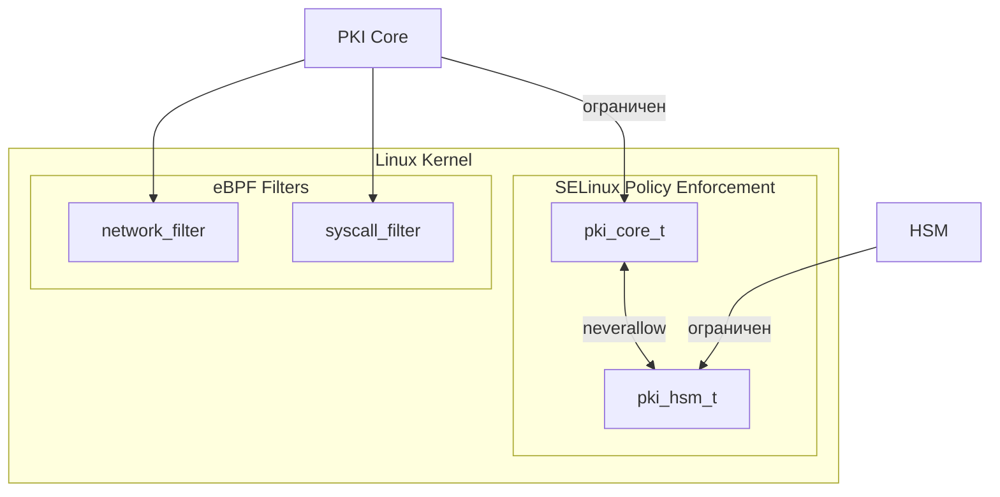

# hw.pki-on-box

> ⚠️ **Учебный проект** — исследование PKI, TRNG и безопасности ядра Linux. Не предназначен для production использования без независимого аудита безопасности.

**Учебный проект**: PKI сервер + менеджер ключей на базе Radxa Zero (Linux) + STM32H750VBT6 (TRNG via USB HID).

## Цель проекта

Собрать физическую PKI коробочку (Radxa Zero + STM32H750 в корпусе) которая:

- загружается с Buildroot образа
- использует STM32H750 как аппаратный источник энтропии (USB HID)
- проводит Root CA ceremony с аппаратным TRNG
- выпускает X.509 сертификаты для клиентов (hw.canfd-adapter, hw.servo-drive) по REST API
- изолирует PKI процесс через SELinux + eBPF *(planned)*
- соответствует ISO 26262 ASIL A (учебный уровень)

---

## Статус реализации

| Компонент | Статус | Сессия |
|-----------|--------|--------|
| core: TRNG/DRBG/CryptoEngine/KeyStorage | ✅ done | SESSION_4 |
| services: CA/Cert/CRL/OCSP | ✅ done | SESSION_6 |
| storage: SQLite + FileStorage | ✅ done | SESSION_7 |
| REST API (Flask) | ✅ done | SESSION_9 |
| CLI (Click) | ✅ done | SESSION_10 |
| Integration tests (pytest) | ✅ done | SESSION_11 |
| GitHub Actions CI/CD | ✅ done | SESSION_12 |
| STM32G474 firmware (TRNG USB HID) | ✅ done | SESSION_14 |
| Hardware TRNG интеграция (core/trng.py) | ✅ done | SESSION_17 |
| RAND_add entropy injection (OpenSSL) | ✅ done | SESSION_20 |
| SELinux + eBPF | 📋 planned | SESSION_15 |
| Buildroot image | 📋 planned | SESSION_16 |
| STM32H750 firmware (TRNG HID) | 🔄 in-progress | SESSION_19 |
| End-to-end тест на железе | 📋 planned | SESSION_18 |

---

## Архитектура




## Entropy Chain

Аппаратная энтропия от STM32G474CEU подмешивается в OpenSSL RAND пул перед каждой генерацией ключа — `cryptography` библиотека использует HW энтропию незаметно для себя:

```
STM32G474CEU (USB HID 0x0483:0x5750)
    └─ HardwareTRNG.get_entropy()     64 байта / вызов
        └─ NISTDRBG.generate()        HMAC-DRBG SP 800-90A
            └─ RAND_add()             → OpenSSL RAND пул
                └─ rsa/ec.generate_private_key()
```

Переключение через конфиг (`trng.mode: hardware | auto | software`).
## Структура проекта

```
hw.pki-on-box/
├── .github/workflows/     ← CI/CD (planned)
├── firmware/
│   └── hmi/               ← STM32H750VBT6: TRNG стример (USB HID)
├── asw/
│   └── PKI/               ← Python PKI daemon
│       ├── core/          ← trng, drbg, crypto_engine, key_storage
│       ├── services/      ← ca, certificate, crl, ocsp
│       ├── storage/       ← database, file_storage
│       ├── security/      ← security_manager (planned)
│       ├── api/           ← rest_api.py, cli.py
│       ├── tests/         ← pytest integration tests
│       ├── serve.py       ← REST API entrypoint
│       ├── pki.py         ← CLI entrypoint
│       ├── requirements.txt
│       └── requirements-dev.txt
├── bsw/
│   ├── ebpf/              ← network_filter, syscall_filter (planned)
│   ├── selnux/            ← SELinux политики (planned)
│   └── systemd/           ← pki.service, hsm.service
├── enclosure/             ← физическая сборка
├── image/                 ← Buildroot образ для Radxa Zero
├── pytest.ini
└── docs/
```

---

## Быстрый старт

```bash
# Зависимости
pip install -r asw/PKI/requirements.txt

# Запуск REST API (порт 5000)
cd asw/PKI
python serve.py

# Запуск с software TRNG (без USB HID)
PKI_TRNG_MODE=software python serve.py
```

---

## REST API

Base URL: `http://localhost:5000/api/v1`

```bash
# Создать Root CA
curl -X POST /api/v1/ca/root \
  -H "Content-Type: application/json" \
  -d '{"name": "My Root CA", "validity_years": 20}'
# → {"ca_id": "ca_my_root_ca", "cert_pem": "-----BEGIN CERTIFICATE-----..."}

# Выпустить серверный сертификат
curl -X POST /api/v1/certs/server \
  -d '{"common_name": "device.local", "san_dns": ["device.local"], "ca_id": "ca_my_root_ca"}'
# → {"serial": "...", "cert_pem": "...", "key_pem": "..."}

# Список CA
curl /api/v1/ca

# Отозвать сертификат
curl -X POST /api/v1/crl/revoke \
  -d '{"serial": "<hex>", "ca_id": "ca_my_root_ca"}'

# Получить CRL
curl /api/v1/crl/ca_my_root_ca

# Проверить статус (OCSP)
curl /api/v1/ocsp/<serial_hex>
```

---

## CLI

```bash
cd asw/PKI

# Создать Root CA
python pki.py ca create-root --name "My Root CA"

# Создать Intermediate CA
python pki.py ca create-intermediate --name "Devices CA" --parent ca_my_root_ca

# Список CA
python pki.py ca list

# Выпустить серверный сертификат
python pki.py cert issue-server --cn device.local --san device.local --ca ca_my_root_ca --out ./certs

# Выпустить клиентский сертификат
python pki.py cert issue-client --user device-001 --ca ca_my_root_ca --out ./certs

# Выпустить firmware сертификат
python pki.py cert issue-firmware --device stm32-001 --ca ca_my_root_ca --out ./certs

# Отозвать сертификат
python pki.py crl revoke --serial <hex> --ca ca_my_root_ca --reason key_compromise

# Сгенерировать CRL
python pki.py crl generate --ca ca_my_root_ca --out crl.pem

# Проверить статус сертификата
python pki.py crl check --serial <hex>
```

---

## Тестирование

```bash
# Установить dev-зависимости
pip install -r asw/PKI/requirements-dev.txt

# Запустить все тесты
PKI_TRNG_MODE=software pytest asw/PKI/tests/ -v

# Результат: 21 passed
```

Покрытие тестами:

| Файл | Что тестирует |
|------|---------------|
| `tests/conftest.py` | фикстуры: cfg, services, root_ca, flask client |
| `tests/test_core.py` | TRNG, DRBG, RSA/EC sign-verify, KeyStorage |
| `tests/test_services.py` | CA/Cert/CRL/OCSP, DB persistence, FileStorage |
| `tests/test_api.py` | все REST endpoints |

---

## Конфигурация

Пример конфига: `asw/PKI/config.example.yaml`

Переменные окружения:

| Переменная | По умолчанию | Описание |
|------------|-------------|----------|
| `PKI_TRNG_MODE` | `auto` | `auto` / `hardware` / `software` |
| `PKI_STORAGE_PATH` | `asw/PKI/storage/keys` | путь к хранилищу ключей |
| `PKI_DB_PATH` | `asw/PKI/storage/pki.db` | путь к SQLite БД |
| `PKI_CERTS_PATH` | `asw/PKI/storage/certs` | путь к файлам сертификатов |

> Хранилище **не хранится в репозитории** — инициализируется при первом запуске.

---

## Безопасность ядра *(planned)*



---

## Стандарты

- ISO 26262 ASIL A (учебный уровень)
- NIST SP 800-90A (DRBG)
- NIST SP 800-57 (Key Management)
