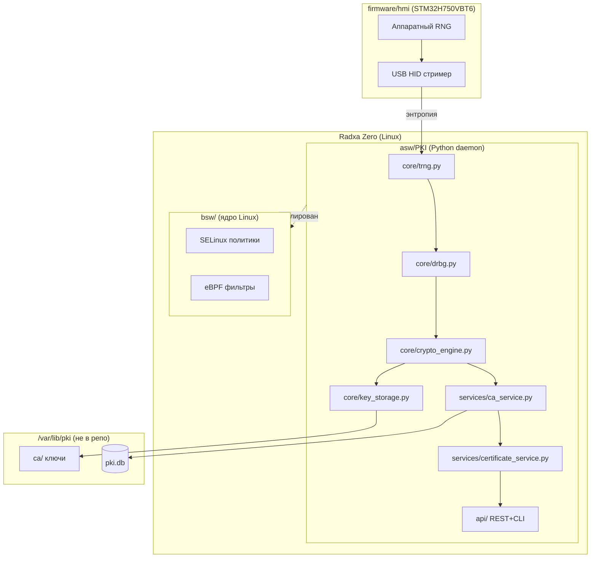

# hw.pki-on-box

> ⚠️ **Учебный проект** — исследование PKI, TRNG и безопасности ядра Linux. Не предназначен для production использования без независимого аудита безопасности.

**Учебный проект**: PKI сервер + менеджер ключей на базе Radxa Zero (Linux) + STM32H750VBT6 (TRNG via USB HID).

---

## Архитектура



## Структура проекта

```
hw.pki-on-box/
├── firmware/
│   └── hmi/           ← STM32H750VBT6: TRNG стример (USB HID)
├── asw/
│   ├── PKI/           ← Python PKI daemon
│   │   ├── core/      ← trng, drbg, crypto_engine, key_storage
│   │   ├── services/  ← ca, certificate, crl, ocsp
│   │   ├── storage/   ← database, file_storage, master_root_ca
│   │   ├── security/  ← security_manager (SELinux + eBPF)
│   │   └── api/       ← REST API, CLI
│   └── sandbox/       ← исследовательский код (TRNG/DRBG прототипы)
├── bsw/
│   ├── ebpf/          ← network_filter, syscall_filter
│   ├── selnux/        ← SELinux политики
│   └── systemd/       ← pki.service, hsm.service
├── enclosure/         ← физическая сборка
│   └── pcb/           ← схема Radxa Zero + STM32H750
├── image/             ← Buildroot образ для Radxa Zero
└── docs/

```

## Безопасность ядра

```
┌─────────────────────────────────────────────────┐
│                  pki-box system                 │
├─────────────────────────────────────────────────┤
│  PKI Core (pki_core_t) ← eBPF filters → HSM    │
│               ↓                                 │
│        SELinux Policy Enforcement               │
│               ↓                                 │
│        Linux Kernel (SELinux + eBPF)            │
└─────────────────────────────────────────────────┘
```

## Инициализация хранилища

Хранилище **не хранится в репозитории** — инициализируется при первом запуске:

```bash
python -m asw.PKI.main init --storage-path /var/lib/pki
```

## Диагностика

```bash
# SELinux контексты
ps -eZ | grep pki
ls -Z /var/lib/pki/

# eBPF программы
bpftool prog show
bpftool map show

# Аудит
ausearch -m avc -ts recent
```

## Стандарты

- ISO 26262 ASIL A (учебный уровень)
- NIST SP 800-90A (DRBG)
- NIST SP 800-57 (Key Management)
