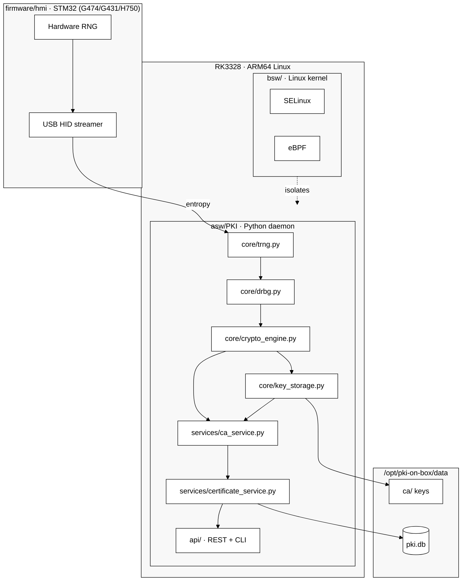

[🇬🇧 English](README.md) | [🇷🇺 Русский](README_RU.md) | [🇫🇷 Français](README_FR.md) | [🇨🇳 简体中文](README_ZH.md)

# hw.pki-on-box

> ⚠️ **Educational project** — exploring PKI, hardware TRNG, SDD contracts and Linux kernel security. Not intended for production use without independent security audit.

PKI server + key manager running on RK3328 (ARM64, Linux) with STM32 as hardware entropy source (TRNG via USB HID). Full entropy chain from silicon to X.509 certificates for $50.

## Why this is different

Most "PKI on GitHub" repos are key generators with a REST API wrapper. That's not PKI.

This project connects low-level hardware to a full PKI stack:

- **Hardware entropy** — STM32 TRNG (G474/G431/H750) feeds real physical randomness into OpenSSL RAND pool. Not `os.urandom()`.
- **NIST DRBG** — HMAC-DRBG SP 800-90A on top of hardware entropy, with health checks.
- **Full PKI** — CA ceremony, X.509 issuance, CRL, OCSP. REST API + CLI.
- **$50 hardware** — RK3328 SBC ($35) + STM32 board ($12). No $10k HSM required.
- **SDD contracts** — firmware verified through Design by Contract (YAML phases/pre/post/invariants) + drift detection.
- **FIPS 140-2** — KAT self-tests, key zeroization, Security Policy documentation (educational level).
- **Tested** — 62 contract tests (mock→real), 99 total tests, GitHub Actions CI.
- **Deployed** — running on real ARM64 hardware with 16 KB/s hardware entropy, 15ms API latency.

The entropy chain from silicon to OpenSSL is documented and open. That's rare.

## What it does

- Runs on RK3328 ARM64 SBC (natively, no Docker)
- Uses STM32 as hardware random number generator (USB HID, 16 KB/s)
- Performs Root CA ceremony with hardware TRNG
- Issues X.509 certificates via REST API (1.6s) and CLI
- FIPS 140-2 KAT self-tests + key zeroization
- SDD contract for firmware TRNG (trng_hid.contract.yaml)
- Multi-board firmware support (STM32G474 / G431 / H750)
- BSW hardening with graceful degradation (SELinux + eBPF planned for kernel 5.x)

---

## Implementation status

| Component | Status |
|-----------|--------|
| core: TRNG / DRBG / CryptoEngine / KeyStorage | ✅ done |
| services: CA / Cert / CRL / OCSP | ✅ done |
| storage: SQLite + FileStorage | ✅ done |
| REST API (Flask) + CLI (Click) | ✅ done |
| Contract tests W1-W2 (62 real tests) | ✅ done |
| FIPS 140-2 (KAT, zeroization, Security Policy) | ✅ done |
| GitHub Actions CI/CD + drift_check | ✅ done |
| STM32 firmware (multi-board G474/G431/H750) | ✅ done |
| SDD firmware contract (trng_hid.contract.yaml) | ✅ done |
| Deploy on RK3328 (native, systemd) | ✅ done |
| HW TRNG validation on target (16 KB/s) | ✅ done |
| BSW hardening (graceful degradation) | ✅ done |
| SELinux + eBPF (full, requires kernel 5.x) | 📋 planned |
| Contract tests W3 (Linux-only) | 📋 planned |

---

## Architecture



## Entropy chain

Hardware entropy from STM32 is injected into the OpenSSL RAND pool before every key generation:

```
STM32 RNG peripheral (USB HID 0x0483:0x5750)
    └─ HardwareTRNG.get_entropy()     64 bytes / call, 16 KB/s
        └─ NISTDRBG.generate()        HMAC-DRBG SP 800-90A
            └─ RAND_add()             → OpenSSL RAND pool
                └─ rsa/ec.generate_private_key()
```

Configurable via `trng.mode: hardware | auto | software`.

## Project structure

```
hw.pki-on-box/
├── .github/workflows/     ← CI/CD (GitHub Actions)
├── firmware/
│   └── hmi/               ← STM32 TRNG streamer (USB HID, multi-board)
│       ├── src/            ← main.c, trng_hid.c, board_config.h
│       ├── boards/         ← G431, H750 board definitions
│       └── platformio.ini  ← G474, G431, H750 environments
├── asw/
│   └── PKI/               ← Python PKI daemon
│       ├── core/           ← trng, drbg, crypto_engine, key_storage
│       ├── services/       ← ca, certificate, crl, ocsp
│       ├── storage/        ← database, file_storage
│       ├── security/       ← security_manager (graceful degradation)
│       ├── api/            ← rest_api.py, cli.py
│       ├── tests/          ← pytest (62 contract + 37 unit)
│       ├── serve.py        ← REST API entrypoint
│       └── pki.py          ← CLI entrypoint
├── bsw/
│   ├── ebpf/              ← network_filter, syscall_filter
│   ├── selinux/           ← SELinux policies (pki-box.te/fc/if)
│   └── systemd/           ← pki.service, hsm.service
├── deploy/
│   ├── deploy.py          ← deployment script (MCP SSH)
│   ├── config.example.yaml
│   └── requirements-rk3328.txt
└── docs/
```

---

## Quick start

```bash
pip install -r asw/PKI/requirements.txt

cd asw/PKI
python serve.py

# Run with software TRNG (no USB HID needed)
PKI_TRNG_MODE=software python serve.py
```

---

## REST API

Base URL: `http://localhost:5000/api/v1`

```bash
# Health check
curl /api/v1/health

# Create Root CA
curl -X POST /api/v1/ca/root \
  -H "Content-Type: application/json" \
  -d '{"name": "My Root CA", "validity_years": 20}'

# Issue server certificate
curl -X POST /api/v1/certs/server \
  -d '{"common_name": "device.local", "san_dns": ["device.local"], "ca_id": "ca_my_root_ca"}'

# List CAs / certificates
curl /api/v1/ca
curl /api/v1/certs

# Revoke certificate
curl -X POST /api/v1/crl/revoke \
  -d '{"serial": "<hex>", "ca_id": "ca_my_root_ca"}'

# Get CRL / OCSP
curl /api/v1/crl/ca_my_root_ca
curl /api/v1/ocsp/<serial_hex>
```

---

## CLI

```bash
cd asw/PKI

python pki.py ca create-root --name "My Root CA"
python pki.py ca list
python pki.py cert issue-server --cn device.local --san device.local --ca ca_my_root_ca --out ./certs
python pki.py crl revoke --serial <hex> --ca ca_my_root_ca --reason key_compromise
python pki.py crl generate --ca ca_my_root_ca --out crl.pem
```

---

## Testing

```bash
pip install -r asw/PKI/requirements-dev.txt
PKI_TRNG_MODE=software pytest asw/PKI/tests/ -v
# Result: 99 passed
```

---

## Configuration

| Variable | Default | Description |
|----------|---------|-------------|
| `PKI_TRNG_MODE` | `auto` | `auto` / `hardware` / `software` |
| `PKI_STORAGE_PATH` | `storage/keys` | key storage path |
| `PKI_DB_PATH` | `storage/pki.db` | SQLite database path |

---

## Deploy on ARM64

Target: RK3328 (Cortex-A53, 2GB RAM, Ubuntu 18.04, Python 3.6)

```bash
# On target
python3 -m venv /opt/pki-on-box/venv
source /opt/pki-on-box/venv/bin/activate
pip install -r deploy/requirements-rk3328.txt

# From dev machine (via MCP SSH or rsync)
# Upload asw/PKI/ → /opt/pki-on-box/app/
# systemctl restart pki
```

---

## Standards

- NIST SP 800-90A (HMAC-DRBG)
- NIST SP 800-90B (entropy source health tests)
- FIPS 140-2 (KAT, zeroization, Security Policy — educational level)
- ISO 26262 ASIL A (educational level)

---

## License

Educational project. See [LICENSE](LICENSE) for details.
