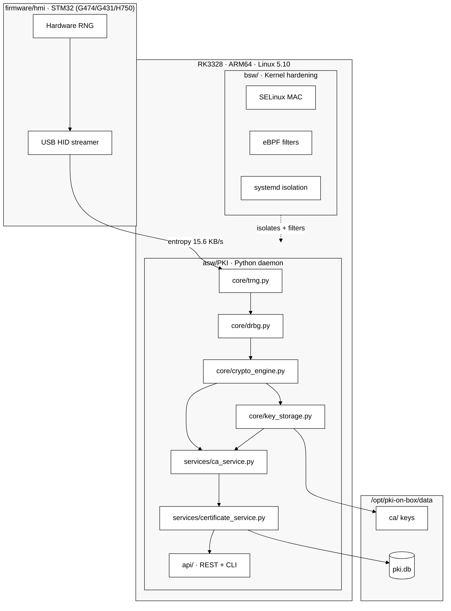
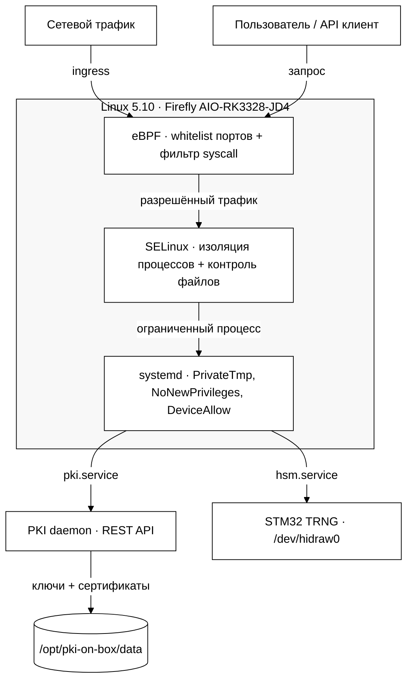

[🇷🇺 Русский](README.md) | [🇬🇧 English](README_EN.md) | [🇫🇷 Français](README_FR.md) | [🇨🇳 简体中文](README_ZH.md)

# hw.pki-on-box

[](https://github.com/vasilievsv/hw.pki-on-box/actions/workflows/ci.yml)
[](LICENSE)
[](https://www.python.org/)
[]()
[]()
[]()
[]()
[](https://github.com/vasilievsv/hw.pki-on-box)

> ⚠️ **Research project** — исследование PKI, аппаратного TRNG, firmware hardening, SDD-контрактов и безопасности ядра Linux. Не проходил независимый аудит безопасности.

PKI-сервер + менеджер ключей на RK3328 (ARM64, Linux 5.10) с STM32G431 в качестве аппаратного источника энтропии (TRNG через USB HID). Полная цепочка энтропии от кремния до X.509 сертификатов за ~$130.

## Чем отличается

Большинство «PKI на GitHub» — это генераторы ключей с REST API обёрткой. Это не PKI.

Этот проект связывает низкоуровневое железо с полным PKI стеком:

- **Аппаратная энтропия** — STM32 TRNG (G474/G431/H750) подаёт физическую случайность в OpenSSL RAND pool. Не `os.urandom()`.
- **Firmware hardening** — 12 уязвимостей закрыты по NIST 800-90B: health checks, startup KAT, watchdog. Ноль открытых.
- **Полный PKI стек** — церемония CA, выпуск X.509 (server/client/firmware), CRL, OCSP. REST API + CLI.
- **Hardening ядра** — кастомное ядро Linux 5.10: SELinux MAC (2 домена) + eBPF фильтры + systemd sandboxing.
- **SDD-контракты** — Design by Contract для PKI host и firmware + drift detection в CI.
- **$129 за всё** — RK3328 SBC + STM32 плата. Задеплоен на реальном ARM64: 15.6 КБ/с энтропии, 1.6с на сертификат.

---

## Архитектура



## 📚 Документация

Полная архитектурная документация в нарративном стиле — каждый документ объясняет не «что», а «почему».

| # | Документ | О чём |
|---|----------|-------|
| 1 | [C4 Context](docs/C4_CONTEXT.md) | Система снаружи: 4 актора, 3 границы доверия |
| 2 | [C4 Container](docs/C4_CONTAINER.md) | Система внутри: 5 слоёв, путь запроса через 11 шагов |
| 3 | [Component Overview](docs/COMPONENT_OVERVIEW.md) | Анатомия: каждый из 16 компонентов — зачем и почему |
| 4 | [Class Diagram](docs/CLASS_DIAGRAM_PKI.md) | 14 классов, цепочка доверия от теплового шума к сертификату |
| 5 | [Sequence Flows](docs/SEQUENCE_PKI_FLOW.md) | 5 историй: startup, ceremony, issuance, revocation, entropy |
| 6 | [Deployment Diagram](docs/DEPLOYMENT_DIAGRAM.md) | Железо: STM32 + RK3328 + USB, $129 за PKI |
| 7 | [Deployment Guide](docs/DEPLOYMENT_GUIDE.md) | 10 шагов от голого железа до первого сертификата |

→ [Полный индекс документации](docs/README.md)

---

## Цепочка энтропии

```
STM32 RNG периферия (USB HID 0x0483:0x5750)
    └─ HardwareTRNG.get_entropy()     64 байта / вызов, 15.6 КБ/с
        └─ NISTDRBG.generate()        HMAC-DRBG SP 800-90A
            └─ RAND_add()             → OpenSSL RAND pool
                └─ rsa/ec.generate_private_key()
```

Настраивается через `trng.mode: hardware | auto | software`.

## Hardening ядра

Ядро 5.10 пересобрано из исходников Rockchip BSP с тремя слоями защиты. Каждый слой работает независимо — компрометация одного не отключает остальные.

Схема читается как поток сверху вниз: трафик входит → eBPF фильтрует → SELinux ограничивает → systemd изолирует → два сервиса (PKI + HSM) → данные.



| Слой | Механизм | Что защищает |
|------|----------|-------------|
| L1 — eBPF | `network_filter.c` — whitelist портов + rate limit; `syscall_filter.c` — whitelist syscall | Фильтрует трафик и системные вызовы до того, как они дойдут до PKI daemon |
| L2 — SELinux | `pki-box.te/fc/if` — type enforcement, file contexts | Ограничивает процессы PKI: доступ только к своим файлам, портам, устройствам |
| L3 — systemd | `pki.service` — PrivateTmp, ProtectSystem; `hsm.service` — DeviceAllow | Изолирует сервисы: отдельные namespace, запрет эскалации привилегий |

## Firmware hardening (NIST 800-90B)

12 уязвимостей выявлены и закрыты в firmware STM32 TRNG:

| # | Уязвимость | Серьёзность | Исправлено |
|---|-----------|-------------|------------|
| G1 | HAL_RNG_GenerateRandomNumber — return value не проверяется | 🔴 CRITICAL | ✅ |
| G2 | Нет проверки RNG_SR.SECS/CECS | 🔴 CRITICAL | ✅ |
| G4 | Нет startup self-test (KAT/TSR-1) | 🔴 CRITICAL | ✅ |
| G6 | Нет continuous health check (TSR-2) | 🔴 CRITICAL | ✅ |
| G8 | HAL_RNG_Init — return value не проверяется | 🔴 CRITICAL | ✅ |
| G13 | HID OUT endpoint не re-arm после SendReport | 🔴 CRITICAL | ✅ |
| G3 | Error_Handler = while(1) без диагностики | 🟡 HIGH | ✅ |
| G5 | Нет watchdog для зависания RNG | 🟡 HIGH | ✅ |
| G7 | HAL_RCCEx — return value не проверяется | 🟡 HIGH | ✅ |
| G9 | Main loop без rate limiting | 🟡 MEDIUM | ✅ |
| G10 | Report ID bias в report[0] | 🟡 MEDIUM | ✅ |
| G11 | Нет RNG IRQ handler (polling OK) | ℹ️ INFO | — |

---

## Статус реализации

| Компонент | Статус |
|-----------|--------|
| core: TRNG / DRBG / CryptoEngine / KeyStorage | ✅ готово |
| services: CA / Cert / CRL / OCSP | ✅ готово |
| storage: SQLite + FileStorage | ✅ готово |
| REST API (Flask) + CLI (client) | ✅ готово |
| Contract-тесты W1-W2 (62 реальных теста) | ✅ готово |
| Contract-тесты W3 (SELinux/eBPF, e2e) | ✅ готово |
| HW TRNG contract-тесты (15/15 passed) | ✅ готово |
| FIPS 140-2 (KAT, зануление, Security Policy) | ✅ готово |
| GitHub Actions CI/CD + drift_check | ✅ готово |
| Firmware STM32 (multi-board G474/G431/H750) | ✅ готово |
| Firmware hardening (12 gaps, NIST 800-90B) | ✅ готово |
| SDD-контракты (crypto-engine + trng_hid) | ✅ готово |
| Деплой на RK3328 (нативный, systemd) | ✅ готово |
| Кастомное ядро 5.10 (SELinux + eBPF + USB2 PHY) | ✅ готово |
| Валидация HW TRNG на железке (15.6 КБ/с) | ✅ готово |
| BSW hardening (graceful degradation) | ✅ готово |

---

## Структура проекта

```
hw.pki-on-box/
├── .github/workflows/     ← CI/CD (lint, test, drift_check, security)
├── firmware/
│   └── hmi/               ← STM32 TRNG streamer (USB HID, multi-board)
│       ├── src/            ← main.c, trng_hid.c, trng_hid_dbc.c, board_config.h
│       ├── boards/         ← G431, G474, H750 board definitions
│       ├── test/           ← HW contract-тесты, диагностика
│       └── platformio.ini  ← G474, G431, H750 environments
├── asw/
│   └── PKI/               ← Python PKI daemon
│       ├── core/           ← trng, drbg, crypto_engine, key_storage
│       ├── services/       ← ca, certificate, crl, ocsp
│       ├── storage/        ← database, file_storage
│       ├── security/       ← security_manager (graceful degradation)
│       ├── api/            ← rest_api.py, cli.py
│       ├── tests/          ← pytest (62 contract + 15 HW + unit)
│       ├── serve.py        ← REST API entrypoint
│       └── pki.py          ← CLI entrypoint
├── bsw/
│   ├── ebpf/              ← network_filter.c, syscall_filter.c
│   ├── selinux/           ← pki-box.te/fc/if (MAC политики)
│   └── systemd/           ← pki.service, hsm.service
├── deploy/
│   ├── deploy.py          ← скрипт деплоя
│   ├── config.example.yaml
│   └── requirements-rk3328.txt
├── scripts/
│   ├── drift_check_host.py
│   ├── drift_check_firmware.py
│   └── drift_check_cross.py
├── enclosure/
│   └── pcb/               ← PCB layout, gerbers, BOM
├── image/                  ← Конфиг ядра Linux (5.10)
└── docs/                   ← Архитектурная документация (C4, Class, Sequence, Deployment)
    └── README.md           ← Индекс документации с порядком чтения
```

---

## Быстрый старт

```bash
pip install -r asw/PKI/requirements.txt

cd asw/PKI
python serve.py

# Запуск с программным TRNG (без USB HID)
PKI_TRNG_MODE=software python serve.py
```

---

## REST API

Базовый URL: `http://localhost:5000/api/v1`

```bash
# Health check
curl /api/v1/health

# Создать Root CA
curl -X POST /api/v1/ca/root \
  -H "Content-Type: application/json" \
  -d '{"name": "My Root CA", "validity_years": 20}'

# Выпустить серверный сертификат
curl -X POST /api/v1/certs/server \
  -d '{"common_name": "device.local", "san_dns": ["device.local"], "ca_id": "ca_my_root_ca"}'

# Список CA / сертификатов
curl /api/v1/ca
curl /api/v1/certs

# Отозвать сертификат
curl -X POST /api/v1/crl/revoke \
  -d '{"serial": "<hex>", "ca_id": "ca_my_root_ca"}'

# Получить CRL / OCSP
curl /api/v1/crl/ca_my_root_ca
curl /api/v1/ocsp/<serial_hex>
```

---

## CLI

```bash
cd asw/PKI

python pki.py ca create-root --name "My Root CA"
python pki.py ca list
python pki.py cert issue-server --cn device.local --san device.local --ca ca_my_root_ca --out ./certs
python pki.py crl revoke --serial <hex> --ca ca_my_root_ca --reason key_compromise
python pki.py crl generate --ca ca_my_root_ca --out crl.pem
```

---

## Тестирование

```bash
pip install -r asw/PKI/requirements-dev.txt

# Все тесты (software TRNG)
PKI_TRNG_MODE=software pytest asw/PKI/tests/ -v
# Результат: 99+ passed

# Hardware TRNG тесты (нужен STM32)
PKI_TRNG_MODE=hardware pytest asw/PKI/tests/ -v -k "hardware"
# Результат: 15/15 passed
```

---

## Конфигурация

| Переменная | По умолчанию | Описание |
|------------|-------------|----------|
| `PKI_TRNG_MODE` | `auto` | `auto` / `hardware` / `software` |
| `PKI_STORAGE_PATH` | `storage/keys` | путь к хранилищу ключей |
| `PKI_DB_PATH` | `storage/pki.db` | путь к базе SQLite |

---

## Деплой на ARM64

Целевая платформа: Firefly AIO-RK3328-JD4 (Cortex-A53, 2GB RAM, Linux 5.10, Python 3.6)

```bash
# На целевом устройстве
python3 -m venv /opt/pki-on-box/venv
source /opt/pki-on-box/venv/bin/activate
pip install -r deploy/requirements-rk3328.txt

# С машины разработки (через MCP SSH или rsync)
# Загрузить asw/PKI/ → /opt/pki-on-box/app/
# systemctl restart pki
```

---

## Железо

| Компонент | Модель | Роль | Цена |
|-----------|--------|------|------|
| SBC | Firefly AIO-RK3328-JD4 | Хост PKI daemon (ARM64, 2GB) | ~$111 |
| TRNG | STM32G431 (WeAct) | Аппаратный источник энтропии (USB HID) | ~$18 |
| Итого | | | ~$129 |

Поддерживаемые платы STM32: G474 (reference), G431 (primary), H750 (experimental).

---

## Производительность

| Метрика | Значение |
|---------|----------|
| TRNG throughput | 15.6 КБ/с |
| TRNG health (χ²) | 253 (лимит: 310) |
| TRNG bit ratio | 0.517 (цель: 0.40–0.60) |
| API GET latency | 15мс |
| Выпуск сертификата | 1.6с |
| FIPS KAT | 6/6 алгоритмов |
| Firmware gaps | 0 открытых (12/12 закрыты) |

---

## Стандарты

- NIST SP 800-90A (HMAC-DRBG)
- NIST SP 800-90B (health tests источника энтропии)
- FIPS 140-2 (KAT, зануление, Security Policy — учебный уровень)
- ISO 26262 ASIL A (учебный уровень)
- SDD / Design by Contract (верификация PKI host + firmware)

---

## Лицензия

Apache-2.0. См. [LICENSE](LICENSE).