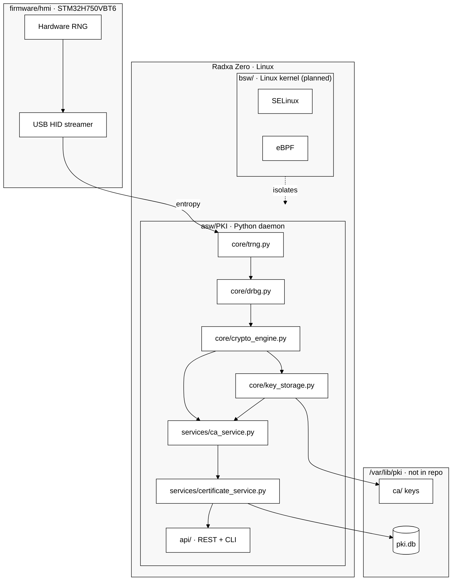
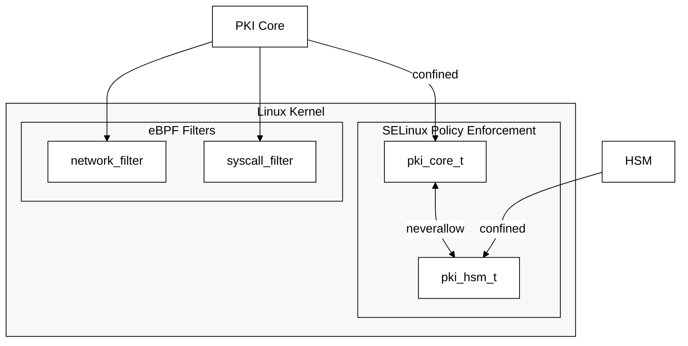

# hw.pki-on-box

> ⚠️ **Educational project** — exploring PKI, hardware TRNG and Linux kernel security. Not intended for production use without independent security audit.

PKI server + key manager running on Radxa Zero (Linux) with STM32H750VBT6 as hardware entropy source (TRNG via USB HID).

## Why this is different

Most "PKI on GitHub" repos are key generators with a REST API wrapper — a Python script calling `cryptography`, maybe wrapped in Docker. That's not PKI.

This project connects low-level hardware to a full PKI stack:

- **Hardware entropy** — STM32 TRNG feeds real physical randomness into OpenSSL RAND pool before every key generation. Not `os.urandom()`.
- **NIST DRBG** — HMAC-DRBG SP 800-90A on top of hardware entropy, not software fallback.
- **Full PKI** — CA ceremony, X.509 issuance, CRL, OCSP. Not "create a root cert".
- **$50 hardware** — Radxa Zero ($35) + STM32H750 ($12). No $10k HSM required.
- **Tested** — 21 automated tests, GitHub Actions CI. Not "I checked it manually".

The entropy chain from silicon to OpenSSL is documented and open. That's rare.

## What it does

- Boots from a minimal Buildroot image
- Uses STM32H750 as hardware random number generator (USB HID)
- Performs Root CA ceremony with hardware TRNG
- Issues X.509 certificates for embedded clients (hw.canfd-adapter, hw.servo-drive) via REST API
- Isolates PKI process via SELinux + eBPF *(planned)*
- Follows ISO 26262 ASIL A (educational level)

---

## Implementation status

| Component | Status |
|-----------|--------|
| core: TRNG / DRBG / CryptoEngine / KeyStorage | ✅ done |
| services: CA / Cert / CRL / OCSP | ✅ done |
| storage: SQLite + FileStorage | ✅ done |
| REST API (Flask) | ✅ done |
| CLI (Click) | ✅ done |
| Integration tests (pytest, 21 passed) | ✅ done |
| GitHub Actions CI/CD | ✅ done |
| STM32G474 firmware (TRNG USB HID) | ✅ done |
| Hardware TRNG integration (core/trng.py) | ✅ done |
| RAND_add entropy injection (OpenSSL) | ✅ done |
| SELinux + eBPF | 📋 planned |
| Buildroot image | 📋 planned |
| STM32H750 firmware (TRNG HID) | 🔄 in-progress |
| End-to-end hardware test | 📋 planned |

---

## Architecture



## Entropy chain

Hardware entropy from STM32G474CEU is injected into the OpenSSL RAND pool before every key generation. The `cryptography` library uses HW entropy transparently:

```
STM32G474CEU (USB HID 0x0483:0x5750)
    └─ HardwareTRNG.get_entropy()     64 bytes / call
        └─ NISTDRBG.generate()        HMAC-DRBG SP 800-90A
            └─ RAND_add()             → OpenSSL RAND pool
                └─ rsa/ec.generate_private_key()
```

Configurable via `trng.mode: hardware | auto | software`.

## Project structure

```
hw.pki-on-box/
├── .github/workflows/     ← CI/CD (planned)
├── firmware/
│   └── hmi/               ← STM32H750VBT6: TRNG streamer (USB HID)
├── asw/
│   └── PKI/               ← Python PKI daemon
│       ├── core/          ← trng, drbg, crypto_engine, key_storage
│       ├── services/      ← ca, certificate, crl, ocsp
│       ├── storage/       ← database, file_storage
│       ├── security/      ← security_manager (planned)
│       ├── api/           ← rest_api.py, cli.py
│       ├── tests/         ← pytest integration tests
│       ├── serve.py       ← REST API entrypoint
│       ├── pki.py         ← CLI entrypoint
│       ├── requirements.txt
│       └── requirements-dev.txt
├── bsw/
│   ├── ebpf/              ← network_filter, syscall_filter (planned)
│   ├── selinux/           ← SELinux policies (planned)
│   └── systemd/           ← pki.service, hsm.service
├── enclosure/             ← physical assembly
├── image/                 ← Buildroot image for Radxa Zero
├── pytest.ini
└── docs/
```

---

## Quick start

```bash
pip install -r asw/PKI/requirements.txt

cd asw/PKI
python serve.py

# Run with software TRNG (no USB HID needed)
PKI_TRNG_MODE=software python serve.py
```

---

## REST API

Base URL: `http://localhost:5000/api/v1`

```bash
# Create Root CA
curl -X POST /api/v1/ca/root \
  -H "Content-Type: application/json" \
  -d '{"name": "My Root CA", "validity_years": 20}'

# Issue server certificate
curl -X POST /api/v1/certs/server \
  -d '{"common_name": "device.local", "san_dns": ["device.local"], "ca_id": "ca_my_root_ca"}'

# List CAs
curl /api/v1/ca

# Revoke certificate
curl -X POST /api/v1/crl/revoke \
  -d '{"serial": "<hex>", "ca_id": "ca_my_root_ca"}'

# Get CRL
curl /api/v1/crl/ca_my_root_ca

# Check status (OCSP)
curl /api/v1/ocsp/<serial_hex>
```

---

## CLI

```bash
cd asw/PKI

python pki.py ca create-root --name "My Root CA"
python pki.py ca create-intermediate --name "Devices CA" --parent ca_my_root_ca
python pki.py ca list

python pki.py cert issue-server --cn device.local --san device.local --ca ca_my_root_ca --out ./certs
python pki.py cert issue-client --user device-001 --ca ca_my_root_ca --out ./certs
python pki.py cert issue-firmware --device stm32-001 --ca ca_my_root_ca --out ./certs

python pki.py crl revoke --serial <hex> --ca ca_my_root_ca --reason key_compromise
python pki.py crl generate --ca ca_my_root_ca --out crl.pem
python pki.py crl check --serial <hex>
```

---

## Testing

```bash
pip install -r asw/PKI/requirements-dev.txt

PKI_TRNG_MODE=software pytest asw/PKI/tests/ -v
# Result: 21 passed
```

| File | Coverage |
|------|----------|
| `tests/conftest.py` | fixtures: cfg, services, root_ca, flask client |
| `tests/test_core.py` | TRNG, DRBG, RSA/EC sign-verify, KeyStorage |
| `tests/test_services.py` | CA/Cert/CRL/OCSP, DB persistence, FileStorage |
| `tests/test_api.py` | all REST endpoints |

---

## Configuration

Example config: `asw/PKI/config.example.yaml`

| Variable | Default | Description |
|----------|---------|-------------|
| `PKI_TRNG_MODE` | `auto` | `auto` / `hardware` / `software` |
| `PKI_STORAGE_PATH` | `asw/PKI/storage/keys` | key storage path |
| `PKI_DB_PATH` | `asw/PKI/storage/pki.db` | SQLite database path |
| `PKI_CERTS_PATH` | `asw/PKI/storage/certs` | certificate files path |

> Storage is **not committed to the repo** — initialized on first run.

---

## Kernel security *(planned)*



---

## Standards

- ISO 26262 ASIL A (educational level)
- NIST SP 800-90A (DRBG)
- NIST SP 800-57 (Key Management)
