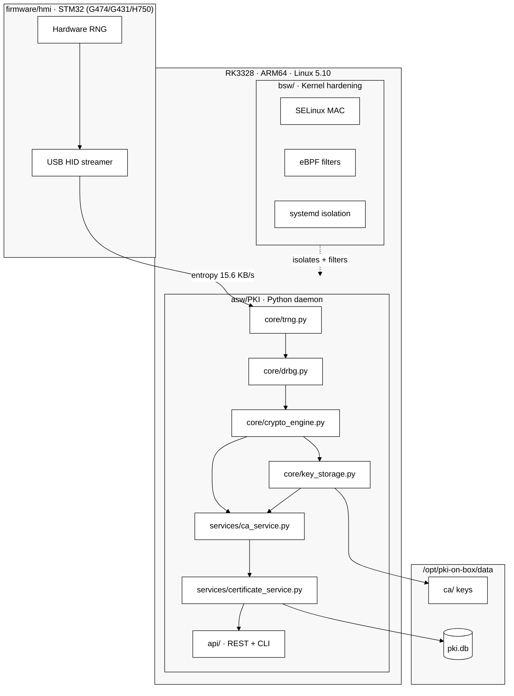
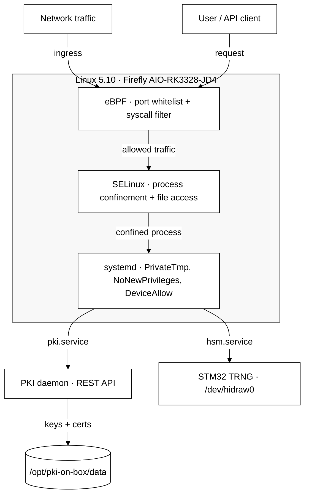

[🇷🇺 Русский](README.md) | [🇬🇧 English](README_EN.md) | [🇫🇷 Français](README_FR.md) | [🇨🇳 简体中文](README_ZH.md)

# hw.pki-on-box

[](https://github.com/vasilievsv/hw.pki-on-box/actions/workflows/ci.yml)
[](LICENSE)
[](https://www.python.org/)
[]()
[]()
[]()
[]()
[](https://github.com/vasilievsv/hw.pki-on-box)

> ⚠️ **Educational project** — exploring PKI, hardware TRNG, firmware hardening, SDD contracts and Linux kernel security. Not intended for production use without independent security audit.

PKI server + key manager running on RK3328 (ARM64, Linux 5.10) with STM32G431 as hardware entropy source (TRNG via USB HID). Full entropy chain from silicon to X.509 certificates for ~$130.

## Why this is different

Most "PKI on GitHub" repos are key generators with a REST API wrapper. That's not PKI.

This project connects low-level hardware to a full PKI stack:

- **Hardware entropy** — STM32 TRNG (G474/G431/H750) feeds real physical randomness into OpenSSL RAND pool. Not `os.urandom()`.
- **Firmware hardening** — 12 security gaps closed per NIST 800-90B: HAL return value checks, RNG health monitoring, startup KAT, IWDG watchdog, error recovery. Zero open gaps.
- **NIST DRBG** — HMAC-DRBG SP 800-90A on top of hardware entropy, with continuous health checks.
- **Full PKI** — CA ceremony, X.509 issuance, CRL, OCSP. REST API + CLI.
- **Kernel hardening** — Custom Linux 5.10 kernel with SELinux MAC + eBPF network/syscall filters on Firefly AIO-RK3328-JD4.
- **$130 hardware** — RK3328 SBC (~$111) + STM32 board (~$18). No $10k HSM required.
- **SDD contracts** — formal verification via Design by Contract: `crypto-engine.contract.yaml` (PKI host) + `trng_hid.contract.yaml` (firmware) + drift detection in CI.
- **FIPS 140-2** — KAT self-tests, key zeroization, Security Policy documentation (educational level).
- **Tested** — 99+ tests total: 62 contract (mock→real), 15 hardware TRNG, security enforcement, e2e.
- **Deployed** — running on real ARM64 hardware with 15.6 KB/s hardware entropy, 15ms API latency.

---

## Architecture



## Entropy chain

```
STM32 RNG peripheral (USB HID 0x0483:0x5750)
    └─ HardwareTRNG.get_entropy()     64 bytes / call, 15.6 KB/s
        └─ NISTDRBG.generate()        HMAC-DRBG SP 800-90A
            └─ RAND_add()             → OpenSSL RAND pool
                └─ rsa/ec.generate_private_key()
```

Configurable via `trng.mode: hardware | auto | software`.

## Kernel hardening

Kernel 5.10 rebuilt from Rockchip BSP sources with three independent defense layers. Compromising one layer does not disable the others.

The diagram reads top-to-bottom: traffic enters → eBPF filters → SELinux confines → systemd isolates → two services (PKI + HSM) → data.



| Layer | Mechanism | What it protects |
|-------|-----------|-----------------|
| L1 — eBPF | `network_filter.c` — port whitelist + rate limit; `syscall_filter.c` — syscall whitelist | Filters traffic and syscalls before they reach PKI daemon |
| L2 — SELinux | `pki-box.te/fc/if` — type enforcement, file contexts | Confines PKI processes: access only to own files, ports, devices |
| L3 — systemd | `pki.service` — PrivateTmp, ProtectSystem; `hsm.service` — DeviceAllow | Isolates services: separate namespaces, no privilege escalation |

## Firmware hardening (NIST 800-90B)

12 security gaps identified and closed in STM32 TRNG firmware:

| # | Gap | Severity | Fix |
|---|-----|----------|-----|
| G1 | HAL_RNG_GenerateRandomNumber return value unchecked | 🔴 CRITICAL | ✅ |
| G2 | No RNG_SR.SECS/CECS health check | 🔴 CRITICAL | ✅ |
| G4 | No startup self-test (KAT/TSR-1) | 🔴 CRITICAL | ✅ |
| G6 | No continuous health check (TSR-2) | 🔴 CRITICAL | ✅ |
| G8 | HAL_RNG_Init return value unchecked | 🔴 CRITICAL | ✅ |
| G13 | HID OUT endpoint not re-armed after SendReport | 🔴 CRITICAL | ✅ |
| G3 | Error_Handler = while(1) without diagnostics | 🟡 HIGH | ✅ |
| G5 | No watchdog for RNG hang | 🟡 HIGH | ✅ |
| G7 | HAL_RCCEx return value unchecked | 🟡 HIGH | ✅ |
| G9 | Main loop without rate limiting | 🟡 MEDIUM | ✅ |
| G10 | Report ID bias in report[0] | 🟡 MEDIUM | ✅ |
| G11 | No RNG IRQ handler (polling OK) | ℹ️ INFO | — |

---

## Implementation status

| Component | Status |
|-----------|--------|
| core: TRNG / DRBG / CryptoEngine / KeyStorage | ✅ done |
| services: CA / Cert / CRL / OCSP | ✅ done |
| storage: SQLite + FileStorage | ✅ done |
| REST API (Flask) + CLI (client) | ✅ done |
| Contract tests W1-W2 (62 real tests) | ✅ done |
| Contract tests W3 (SELinux/eBPF, e2e) | ✅ done |
| HW TRNG contract tests (15/15 passed) | ✅ done |
| FIPS 140-2 (KAT, zeroization, Security Policy) | ✅ done |
| GitHub Actions CI/CD + drift_check | ✅ done |
| STM32 firmware (multi-board G474/G431/H750) | ✅ done |
| Firmware hardening (12 gaps, NIST 800-90B) | ✅ done |
| SDD contracts (crypto-engine + trng_hid) | ✅ done |
| Deploy on RK3328 (native, systemd) | ✅ done |
| Custom kernel 5.10 (SELinux + eBPF + USB2 PHY) | ✅ done |
| HW TRNG validation on target (15.6 KB/s) | ✅ done |
| BSW hardening (graceful degradation) | ✅ done |

---

## Quick start

```bash
pip install -r asw/PKI/requirements.txt
cd asw/PKI
PKI_TRNG_MODE=software python serve.py
```

---

## Testing

```bash
pip install -r asw/PKI/requirements-dev.txt

# All tests (software TRNG mode)
PKI_TRNG_MODE=software pytest asw/PKI/tests/ -v
# Result: 99+ passed

# Hardware TRNG tests (requires STM32 connected)
PKI_TRNG_MODE=hardware pytest asw/PKI/tests/ -v -k "hardware"
# Result: 15/15 passed
```

---

## Performance

| Metric | Value |
|--------|-------|
| TRNG throughput | 15.6 KB/s |
| TRNG health (χ²) | 253 (limit: 310) |
| TRNG bit ratio | 0.517 (target: 0.40–0.60) |
| API GET latency | 15ms |
| Cert issuance | 1.6s |
| FIPS KAT | 6/6 algorithms |
| Firmware gaps | 0 open (12/12 closed) |

---

## Standards

- NIST SP 800-90A (HMAC-DRBG)
- NIST SP 800-90B (entropy source health tests)
- FIPS 140-2 (KAT, zeroization, Security Policy — educational level)
- ISO 26262 ASIL A (safety analysis — educational level)
- SDD / Design by Contract (PKI host + firmware verification)

---

## License

Apache-2.0. See [LICENSE](LICENSE).