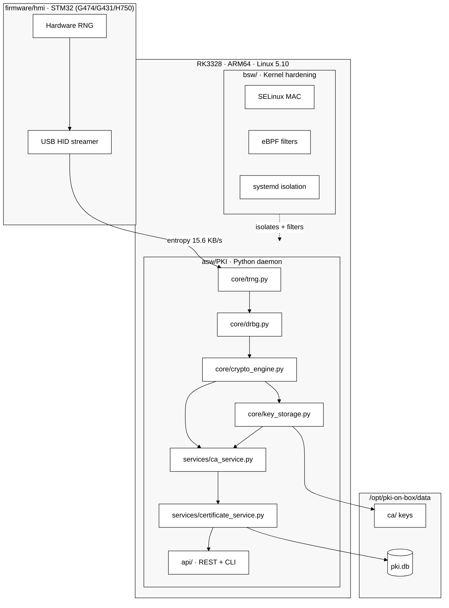
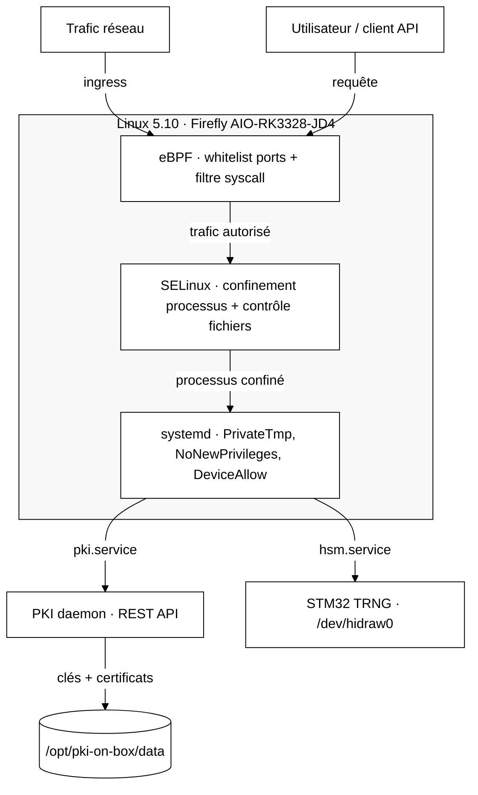

[🇷🇺 Русский](README.md) | [🇬🇧 English](README_EN.md) | [🇫🇷 Français](README_FR.md) | [🇨🇳 简体中文](README_ZH.md)

# hw.pki-on-box

[](https://github.com/vasilievsv/hw.pki-on-box/actions/workflows/ci.yml)
[](LICENSE)
[](https://www.python.org/)
[]()
[]()
[]()
[]()
[](https://github.com/vasilievsv/hw.pki-on-box)

> ⚠️ **Projet éducatif** — exploration de la PKI, du TRNG matériel, du durcissement firmware, des contrats SDD et de la sécurité du noyau Linux. Non destiné à la production sans audit de sécurité indépendant.

Serveur PKI + gestionnaire de clés sur RK3328 (ARM64, Linux 5.10) avec STM32G431 comme source d'entropie matérielle (TRNG via USB HID). Chaîne d'entropie complète du silicium aux certificats X.509 pour ~130$.

## En quoi c'est différent

La plupart des dépôts « PKI sur GitHub » sont des générateurs de clés avec une API REST. Ce n'est pas de la PKI.

Ce projet connecte du matériel bas niveau à une pile PKI complète :

- **Entropie matérielle** — le TRNG STM32 (G474/G431/H750) injecte de l'aléa physique réel dans le pool RAND d'OpenSSL. Pas `os.urandom()`.
- **Durcissement firmware** — 12 failles de sécurité corrigées selon NIST 800-90B : vérifications HAL, surveillance RNG, KAT au démarrage, watchdog IWDG, récupération d'erreurs. Zéro faille ouverte.
- **NIST DRBG** — HMAC-DRBG SP 800-90A au-dessus de l'entropie matérielle, avec contrôles de santé continus.
- **PKI complète** — cérémonie CA, émission X.509, CRL, OCSP. API REST + CLI.
- **Durcissement noyau** — noyau Linux 5.10 personnalisé avec SELinux MAC + filtres eBPF sur Firefly AIO-RK3328-JD4.
- **Matériel à ~130$** — SBC RK3328 (~111$) + carte STM32 (~18$). Pas de HSM à 10k$.
- **Contrats SDD** — vérification formelle via Design by Contract : `crypto-engine.contract.yaml` (hôte PKI) + `trng_hid.contract.yaml` (firmware) + détection de dérive en CI.
- **FIPS 140-2** — auto-tests KAT, mise à zéro des clés, documentation Security Policy (niveau éducatif).
- **Testé** — 99+ tests : 62 contrats (mock→réel), 15 TRNG matériel, enforcement sécurité, e2e.
- **Déployé** — fonctionne sur du matériel ARM64 réel : 15.6 Ko/s d'entropie, 15ms de latence API.

---

## Architecture



## Chaîne d'entropie

```
Périphérique RNG STM32 (USB HID 0x0483:0x5750)
    └─ HardwareTRNG.get_entropy()     64 octets / appel, 15.6 Ko/s
        └─ NISTDRBG.generate()        HMAC-DRBG SP 800-90A
            └─ RAND_add()             → pool RAND OpenSSL
                └─ rsa/ec.generate_private_key()
```

Configurable via `trng.mode: hardware | auto | software`.

## Durcissement du noyau

Le noyau 5.10 est recompilé à partir des sources Rockchip BSP avec trois couches de défense indépendantes. La compromission d'une couche ne désactive pas les autres.

Le diagramme se lit de haut en bas : le trafic entre → eBPF filtre → SELinux confine → systemd isole → deux services (PKI + HSM) → données.



| Couche | Mécanisme | Ce qu'elle protège |
|--------|-----------|-------------------|
| L1 — eBPF | `network_filter.c` — whitelist ports + rate limit ; `syscall_filter.c` — whitelist syscall | Filtre le trafic et les appels système avant qu'ils n'atteignent le daemon PKI |
| L2 — SELinux | `pki-box.te/fc/if` — type enforcement, file contexts | Confine les processus PKI : accès uniquement à leurs fichiers, ports, périphériques |
| L3 — systemd | `pki.service` — PrivateTmp, ProtectSystem ; `hsm.service` — DeviceAllow | Isole les services : namespaces séparés, pas d'escalade de privilèges |

## Durcissement firmware (NIST 800-90B)

12 failles de sécurité identifiées et corrigées dans le firmware STM32 TRNG :

| # | Faille | Sévérité | Corrigé |
|---|--------|----------|---------|
| G1 | HAL_RNG_GenerateRandomNumber — valeur retour non vérifiée | 🔴 CRITICAL | ✅ |
| G2 | Pas de vérification RNG_SR.SECS/CECS | 🔴 CRITICAL | ✅ |
| G4 | Pas d'auto-test au démarrage (KAT/TSR-1) | 🔴 CRITICAL | ✅ |
| G6 | Pas de contrôle de santé continu (TSR-2) | 🔴 CRITICAL | ✅ |
| G8 | HAL_RNG_Init — valeur retour non vérifiée | 🔴 CRITICAL | ✅ |
| G13 | HID OUT endpoint non ré-armé après SendReport | 🔴 CRITICAL | ✅ |
| G3 | Error_Handler = while(1) sans diagnostic | 🟡 HIGH | ✅ |
| G5 | Pas de watchdog pour blocage RNG | 🟡 HIGH | ✅ |
| G7 | HAL_RCCEx — valeur retour non vérifiée | 🟡 HIGH | ✅ |
| G9 | Boucle principale sans limitation de débit | 🟡 MEDIUM | ✅ |
| G10 | Biais Report ID dans report[0] | 🟡 MEDIUM | ✅ |
| G11 | Pas de handler IRQ RNG (polling OK) | ℹ️ INFO | — |

---

## Statut d'implémentation

| Composant | Statut |
|-----------|--------|
| core : TRNG / DRBG / CryptoEngine / KeyStorage | ✅ terminé |
| services : CA / Cert / CRL / OCSP | ✅ terminé |
| stockage : SQLite + FileStorage | ✅ terminé |
| API REST (Flask) + CLI (client) | ✅ terminé |
| Tests de contrat W1-W2 (62 tests réels) | ✅ terminé |
| Tests de contrat W3 (SELinux/eBPF, e2e) | ✅ terminé |
| Tests HW TRNG (15/15 réussis) | ✅ terminé |
| FIPS 140-2 (KAT, mise à zéro, Security Policy) | ✅ terminé |
| CI/CD GitHub Actions + drift_check | ✅ terminé |
| Firmware STM32 (multi-cartes G474/G431/H750) | ✅ terminé |
| Durcissement firmware (12 failles, NIST 800-90B) | ✅ terminé |
| Contrat SDD firmware (trng_hid.contract.yaml) | ✅ terminé |
| Contrats SDD (crypto-engine + trng_hid) | ✅ terminé |
| Déploiement sur RK3328 (natif, systemd) | ✅ terminé |
| Noyau personnalisé 5.10 (SELinux + eBPF + USB2 PHY) | ✅ terminé |
| Validation HW TRNG sur cible (15.6 Ko/s) | ✅ terminé |
| Durcissement BSW (dégradation gracieuse) | ✅ terminé |

---

## Démarrage rapide

```bash
pip install -r asw/PKI/requirements.txt
cd asw/PKI
PKI_TRNG_MODE=software python serve.py
```

---

## Tests

```bash
pip install -r asw/PKI/requirements-dev.txt

# Tous les tests (TRNG logiciel)
PKI_TRNG_MODE=software pytest asw/PKI/tests/ -v
# Résultat : 99+ réussis

# Tests TRNG matériel (STM32 requis)
PKI_TRNG_MODE=hardware pytest asw/PKI/tests/ -v -k "hardware"
# Résultat : 15/15 réussis
```

---

## Performance

| Métrique | Valeur |
|----------|--------|
| Débit TRNG | 15.6 Ko/s |
| Santé TRNG (χ²) | 253 (limite : 310) |
| Ratio bits TRNG | 0.517 (cible : 0.40–0.60) |
| Latence API GET | 15ms |
| Émission certificat | 1.6s |
| FIPS KAT | 6/6 algorithmes |
| Failles firmware | 0 ouverte (12/12 corrigées) |

---

## Normes

- NIST SP 800-90A (HMAC-DRBG)
- NIST SP 800-90B (tests de santé de la source d'entropie)
- FIPS 140-2 (KAT, mise à zéro, Security Policy — niveau éducatif)
- ISO 26262 ASIL A (niveau éducatif)
- SDD / Design by Contract (vérification hôte PKI + firmware)

---

## Licence

Apache-2.0. Voir [LICENSE](LICENSE).