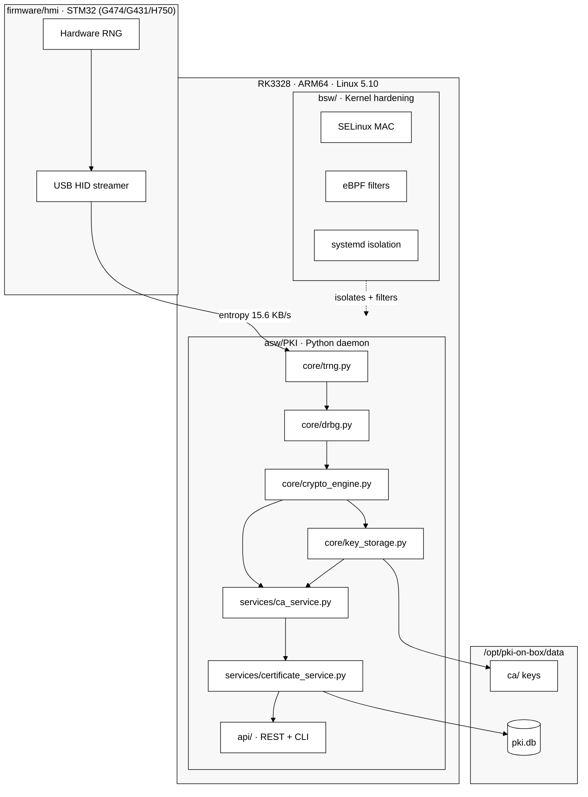
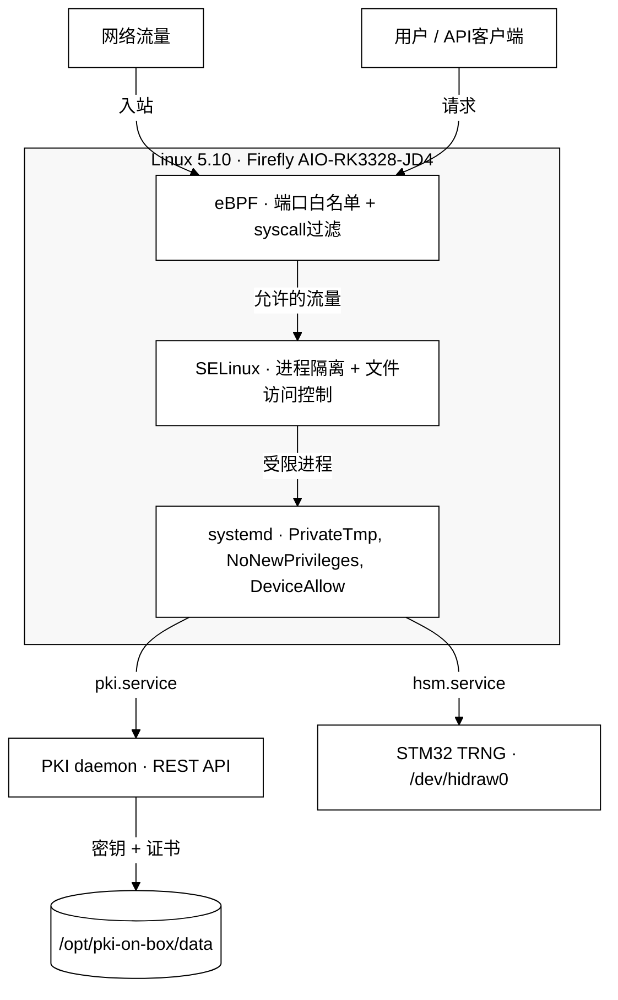

[🇷🇺 Русский](README.md) | [🇬🇧 English](README_EN.md) | [🇫🇷 Français](README_FR.md) | [🇨🇳 简体中文](README_ZH.md)

# hw.pki-on-box

[](https://github.com/vasilievsv/hw.pki-on-box/actions/workflows/ci.yml)
[](LICENSE)
[](https://www.python.org/)
[]()
[]()
[]()
[]()
[](https://github.com/vasilievsv/hw.pki-on-box)

> ⚠️ **教学项目** — 探索PKI、硬件TRNG、固件加固、SDD合约和Linux内核安全。未经独立安全审计，不适用于生产环境。

PKI服务器 + 密钥管理器，运行在RK3328（ARM64，Linux 5.10）上，使用STM32G431作为硬件熵源（通过USB HID的TRNG）。从芯片到X.509证书的完整熵链，成本约130美元。

## 有何不同

GitHub上大多数"PKI"仓库只是带REST API的密钥生成器。那不是PKI。

本项目将底层硬件连接到完整的PKI栈：

- **硬件熵** — STM32 TRNG（G474/G431/H750）将真实物理随机性注入OpenSSL RAND池。不是`os.urandom()`。
- **固件加固** — 按NIST 800-90B修复12个安全漏洞：HAL返回值检查、RNG健康监控、启动KAT、IWDG看门狗、错误恢复。零未修复漏洞。
- **NIST DRBG** — 基于硬件熵的HMAC-DRBG SP 800-90A，带持续健康检查。
- **完整PKI** — CA仪式、X.509签发、CRL、OCSP。REST API + CLI。
- **内核加固** — 定制Linux 5.10内核，带SELinux MAC + eBPF过滤器，运行在Firefly AIO-RK3328-JD4上。
- **130美元硬件** — RK3328 SBC（~111美元）+ STM32开发板（~18美元）。无需1万美元的HSM。
- **SDD合约** — 通过Design by Contract进行形式化验证：`crypto-engine.contract.yaml`（PKI主机）+ `trng_hid.contract.yaml`（固件）+ CI中的漂移检测。
- **FIPS 140-2** — KAT自检、密钥清零、安全策略文档（教学级别）。
- **已测试** — 99+测试：62个合约（mock→real）、15个硬件TRNG、安全执行、端到端。
- **已部署** — 在真实ARM64硬件上运行：15.6 KB/s硬件熵，15ms API延迟。

---

## 架构



## 熵链

```
STM32 RNG外设（USB HID 0x0483:0x5750）
    └─ HardwareTRNG.get_entropy()     64字节/次，15.6 KB/s
        └─ NISTDRBG.generate()        HMAC-DRBG SP 800-90A
            └─ RAND_add()             → OpenSSL RAND池
                └─ rsa/ec.generate_private_key()
```

通过 `trng.mode: hardware | auto | software` 配置。

## 内核加固

内核5.10从Rockchip BSP源码重新编译，包含三个独立的防御层。一个层被攻破不会影响其他层。

图表从上到下阅读：流量进入 → eBPF过滤 → SELinux限制 → systemd隔离 → 两个服务（PKI + HSM）→ 数据。



| 层 | 机制 | 保护内容 |
|----|------|---------|
| L1 — eBPF | `network_filter.c` — 端口白名单 + 速率限制；`syscall_filter.c` — syscall白名单 | 在流量和系统调用到达PKI daemon之前进行过滤 |
| L2 — SELinux | `pki-box.te/fc/if` — 类型强制、文件上下文 | 限制PKI进程：仅访问自己的文件、端口、设备 |
| L3 — systemd | `pki.service` — PrivateTmp, ProtectSystem；`hsm.service` — DeviceAllow | 隔离服务：独立命名空间，禁止权限提升 |

## 固件加固（NIST 800-90B）

STM32 TRNG固件中发现并修复12个安全漏洞：

| # | 漏洞 | 严重性 | 已修复 |
|---|------|--------|--------|
| G1 | HAL_RNG_GenerateRandomNumber返回值未检查 | 🔴 严重 | ✅ |
| G2 | 无RNG_SR.SECS/CECS健康检查 | 🔴 严重 | ✅ |
| G4 | 无启动自检（KAT/TSR-1） | 🔴 严重 | ✅ |
| G6 | 无持续健康检查（TSR-2） | 🔴 严重 | ✅ |
| G8 | HAL_RNG_Init返回值未检查 | 🔴 严重 | ✅ |
| G13 | HID OUT端点在SendReport后未重新激活 | 🔴 严重 | ✅ |
| G3 | Error_Handler = while(1)无诊断 | 🟡 高 | ✅ |
| G5 | 无RNG挂起看门狗 | 🟡 高 | ✅ |
| G7 | HAL_RCCEx返回值未检查 | 🟡 高 | ✅ |
| G9 | 主循环无速率限制 | 🟡 中 | ✅ |
| G10 | report[0]中的Report ID偏差 | 🟡 中 | ✅ |
| G11 | 无RNG IRQ处理程序（轮询OK） | ℹ️ 信息 | — |

---

## 实现状态

| 组件 | 状态 |
|------|------|
| core：TRNG / DRBG / CryptoEngine / KeyStorage | ✅ 完成 |
| services：CA / Cert / CRL / OCSP | ✅ 完成 |
| storage：SQLite + FileStorage | ✅ 完成 |
| REST API（Flask）+ CLI（client） | ✅ 完成 |
| 合约测试 W1-W2（62个真实测试） | ✅ 完成 |
| 合约测试 W3（SELinux/eBPF，端到端） | ✅ 完成 |
| 硬件TRNG合约测试（15/15通过） | ✅ 完成 |
| FIPS 140-2（KAT、清零、安全策略） | ✅ 完成 |
| GitHub Actions CI/CD + drift_check | ✅ 完成 |
| STM32固件（多板 G474/G431/H750） | ✅ 完成 |
| 固件加固（12个漏洞，NIST 800-90B） | ✅ 完成 |
| SDD固件合约（trng_hid.contract.yaml） | ✅ 完成 |
| SDD合约（crypto-engine + trng_hid） | ✅ 完成 |
| 部署到RK3328（原生，systemd） | ✅ 完成 |
| 定制内核5.10（SELinux + eBPF + USB2 PHY） | ✅ 完成 |
| 目标硬件上的HW TRNG验证（15.6 KB/s） | ✅ 完成 |
| BSW加固（优雅降级） | ✅ 完成 |

---

## 快速开始

```bash
pip install -r asw/PKI/requirements.txt
cd asw/PKI
PKI_TRNG_MODE=software python serve.py
```

---

## 测试

```bash
pip install -r asw/PKI/requirements-dev.txt

# 所有测试（软件TRNG模式）
PKI_TRNG_MODE=software pytest asw/PKI/tests/ -v
# 结果：99+通过

# 硬件TRNG测试（需要STM32）
PKI_TRNG_MODE=hardware pytest asw/PKI/tests/ -v -k "hardware"
# 结果：15/15通过
```

---

## 性能

| 指标 | 值 |
|------|-----|
| TRNG吞吐量 | 15.6 KB/s |
| TRNG健康（χ²） | 253（限制：310） |
| TRNG比特比率 | 0.517（目标：0.40–0.60） |
| API GET延迟 | 15ms |
| 证书签发 | 1.6s |
| FIPS KAT | 6/6算法 |
| 固件漏洞 | 0未修复（12/12已修复） |

---

## 标准

- NIST SP 800-90A（HMAC-DRBG）
- NIST SP 800-90B（熵源健康测试）
- FIPS 140-2（KAT、清零、安全策略 — 教学级别）
- ISO 26262 ASIL A（教学级别）
- SDD / Design by Contract（PKI主机 + 固件验证）

---

## 许可证

Apache-2.0。详见 [LICENSE](LICENSE)。