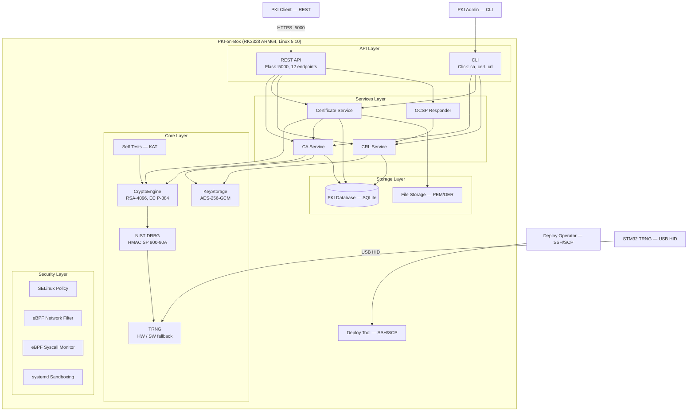

# C4 Container: PKI-on-Box — что внутри чёрного ящика

## О чём эта диаграмма

Context показал систему снаружи. Container разрезает её и показывает внутренности: какие процессы работают, какие хранилища используются, как данные текут между ними. Это уровень, на котором принимаются архитектурные решения — и на котором их последствия становятся видны.



---

## Пять слоёв и логика их разделения

Система разделена на пять слоёв, и это не произвольная группировка по папкам. Каждый слой отвечает на свой вопрос:

- API Layer: как пользователь общается с системой?
- Services Layer: какие операции система умеет выполнять?
- Core Layer: какие криптографические гарантии система даёт?
- Storage Layer: где и как хранятся данные?
- Security Layer: что произойдёт, если всё вышеперечисленное будет скомпрометировано?

Обратите внимание на направление зависимостей: API зависит от Services, Services от Core, Core от ничего (кроме TRNG hardware). Security Layer не зависит ни от кого — он работает на уровне ядра и не знает о существовании Python. Это не случайность, это принцип: механизмы защиты не должны зависеть от того, что они защищают.

## API Layer: два входа, одна причина

У системы два интерфейса — REST API и CLI. Казалось бы, зачем два? Один endpoint `/api/v1/ca/root` мог бы заменить команду `ca create-root`. Но разница не в функциональности, а в модели угроз.

REST API (Flask, порт 5000) — это сетевой интерфейс. Каждый запрос проходит через TCP стек, HTTP парсер, JSON десериализатор, Flask router. Каждый из этих компонентов — потенциальная поверхность атаки. REST API предназначен для рутинных операций: выпуск сертификатов, проверка статуса, получение CRL. Если атакующий найдёт уязвимость в Flask — он сможет выпустить сертификат, но не сможет создать новый Root CA.

CLI (Click) — это локальный интерфейс. Никакого сетевого стека, никакого парсера HTTP. Команды вводятся человеком, который сидит перед терминалом (или подключён по SSH, но это уже его ответственность). CLI используется для критических операций: создание CA, церемонии, экспорт ключей. Разделение не техническое — оно организационное: рутину можно автоматизировать через API, церемонии требуют человека.

12 endpoints REST API покрывают полный жизненный цикл:

```
Создание:  POST /ca/root, /ca/intermediate
Выпуск:    POST /certs/server, /certs/client, /certs/firmware
Отзыв:     POST /crl/revoke
Проверка:  GET  /ca, /ca/{id}/cert, /certs, /crl/{ca_id}, /ocsp/{serial}
Здоровье:  GET  /health
```

Заметьте симметрию: для каждого типа сертификата (server, client, firmware) — отдельный endpoint. Не один `/certs` с параметром `type`, а три разных. Почему? Потому что у каждого типа — разные обязательные поля (`san_dns` для server, `user_id` для client, `device_id` для firmware), разные алгоритмы (RSA-2048 vs EC P-384) и разные сроки жизни (1 год vs 5 лет). Один endpoint с кучей optional-полей — это приглашение к ошибкам. Три явных endpoint — это три контракта, каждый из которых можно валидировать независимо.

## Services Layer: четыре сервиса, один жизненный цикл

Четыре сервиса — это не четыре микросервиса (они живут в одном процессе), а четыре фазы жизненного цикла сертификата.

`CertificateAuthorityService` — это фундамент. Без CA нет сертификатов. Root CA создаётся один раз при церемонии и живёт 20 лет. Intermediate CA создаётся по необходимости и живёт 10 лет. Почему двухуровневая иерархия, а не одноуровневая? Потому что Root CA — это единственная точка, которую нельзя отозвать. Если Root скомпрометирован — вся PKI мертва. Intermediate можно отозвать и создать новый, не трогая Root.

CA Service хранит сертификаты CA в in-memory cache (`_certs` dict). Это не оптимизация — это необходимость. При каждом выпуске сертификата нужен `issuer_name` из CA cert. На RK3328 с Python 3.6 каждое обращение к SQLite — это ~5ms. При выпуске 100 сертификатов подряд (batch provisioning IoT-устройств) — это полсекунды только на чтение CA cert. Кэш убирает эту задержку.

`CertificateService` — рабочая лошадка. Три метода, три типа сертификатов, три модели использования:

- `issue_server_certificate` — TLS для веб-серверов. RSA-2048 (не 4096 — потому что TLS handshake на ARM64 с RSA-4096 занимает 800ms, а с RSA-2048 — 200ms). SAN (Subject Alternative Name) обязателен — без него Chrome не примет сертификат. Срок — 1 год, потому что Let's Encrypt приучил индустрию к короткоживущим сертификатам, и это правильно.

- `issue_client_certificate` — аутентификация пользователей. EC P-384 — потому что клиентские сертификаты часто хранятся на смарт-картах или в мобильных устройствах, где размер подписи имеет значение (EC P-384 подпись — 96 байт, RSA-2048 — 256 байт). `contentCommitment` в KeyUsage — это non-repudiation: подпись этим ключом юридически значима.

- `issue_firmware_certificate` — подпись прошивок. RSA-2048 + CODE_SIGNING. 5 лет — потому что устройство в поле может работать годами без обновления, и его сертификат должен быть валиден всё это время. `contentCommitment` здесь тоже включён — подпись прошивки должна быть верифицируема даже через годы.

Все три метода используют общий `_base_builder()` — Template Method без наследования. Общие поля (subject, issuer, serial, validity, BasicConstraints) вынесены в один метод. Каждый `issue_*` добавляет свои extensions. Это не классический GoF — это Python-идиоматичная композиция.

`CRLService` — механизм отзыва. Когда сертификат скомпрометирован, его нужно отозвать. CRL (Certificate Revocation List) — это подписанный CA список всех отозванных serial numbers. `next_update = now + 1 день` — это компромисс: чаще обновлять — больше нагрузка на CA, реже — дольше живёт скомпрометированный сертификат.

`OCSPResponder` — онлайн-альтернатива CRL. Вместо того чтобы скачивать весь список отозванных сертификатов, клиент спрашивает: «этот конкретный serial — отозван?» Ответ валиден 1 час (`next_update = now + 1h`). OCSP делегирует проверку в `CRLService.is_revoked()` — единый источник истины. Два механизма, одна база данных.

## Core Layer: криптографическая цепочка

Это сердце системы — пять компонентов, выстроенных в цепочку. Порядок не случаен: каждый следующий компонент зависит от предыдущего, и эту цепочку нельзя разорвать или переставить.

```
Self Tests → TRNG → DRBG → CryptoEngine → KeyStorage
   (KAT)     (HW)   (NIST)   (OpenSSL)    (AES-GCM)
```

`Self Tests` запускаются первыми — до того, как система начнёт использовать криптографию. Шесть Known Answer Tests проверяют, что AES-256-GCM, HMAC-SHA256, SHA-256, HMAC_DRBG, RSA и ECDSA работают корректно. Это не unit-тесты — это runtime-проверка целостности криптографической библиотеки. Если OpenSSL повреждён (битый бинарь, неправильная версия, аппаратный сбой памяти) — KAT это поймает. Failure = abort, без вариантов.

`TRNG` — мост к аппаратной энтропии. `HardwareTRNG` читает USB HID репорты от STM32, `SoftwareTRNG` — fallback на `os.urandom`. Режим `auto` пробует hardware и молча переключается на software. Health check — bit ratio (0.40-0.60) и chi-square (≤310) — запускается при старте и может быть вызван в любой момент.

`NIST DRBG` — детерминированный генератор на основе HMAC-SHA256. Принимает 32 байта энтропии от TRNG, генерирует криптографически стойкий поток. Reseed каждые 1000 вызовов — свежая энтропия подмешивается автоматически. Это стандарт NIST SP 800-90A, и его реализация намеренно минимальна: 80 строк кода, никаких оптимизаций, никаких нестандартных расширений. Чем проще код — тем проще аудит.

`CryptoEngine` — фасад над OpenSSL. Его главная задача — `_seed_openssl()`: перед каждой генерацией ключей 64 байта из DRBG (который питается от аппаратного TRNG) подмешиваются в OpenSSL RAND pool через `RAND_add()`. Это гарантирует, что даже стандартные OpenSSL генераторы используют аппаратную энтропию. Без этого шага RSA-ключи на RK3328 генерировались бы из `/dev/urandom` — программного генератора ядра, который на embedded-платформе с малым количеством источников энтропии может быть предсказуемым в первые минуты после загрузки.

`KeyStorage` — последнее звено. Приватные ключи шифруются AES-256-GCM с ключом, выведенным из пароля через PBKDF2 (260 000 итераций). После каждой операции открытый текст затирается в памяти (`_zeroize`). При удалении ключа файл перезаписывается нулями, `fsync`, `unlink`. Это не параноя — это стандартная практика для систем, работающих с ключами CA.

## Storage Layer: два хранилища, две задачи

SQLite и файловая система — не дублирование, а разделение ответственности.

`PKIDatabase` (SQLite, 3 таблицы) — это реестр. Кто выпустил, когда, кем подписан, отозван ли. Поиск по serial, фильтрация по CA, список отозванных — всё это SQL-запросы. SQLite выбран осознанно: на RK3328 с 2GB RAM PostgreSQL — расточительство, а файловый формат SQLite переживёт перезагрузку без WAL и журналирования.

`CertificateFileStorage` (PEM/DER файлы) — это экспорт. Когда клиенту нужен сертификат в PEM — он лежит в файле, готовый к отдаче. Индекс `by_label/` — человекочитаемые имена (`server.example.com.pem`), потому что `a3f7b2c1d4e5.pem` — это для машин.

Почему не хранить PEM прямо в SQLite? Потому что `BLOB` в SQLite — это копирование в память при каждом SELECT. Сертификат CA весом 2KB, прочитанный 1000 раз при batch-выпуске — это 2MB лишних аллокаций. Файл читается один раз и кэшируется ОС.

## Security Layer: защита от самих себя

Этот слой принципиально отличается от остальных. Он не написан на Python, не использует Flask, не знает о существовании X.509. Он работает на уровне ядра Linux и защищает систему от ситуации, когда всё вышеперечисленное уже скомпрометировано.

`SELinux Policy` — Mandatory Access Control. Два домена: `pki_core_t` (основной сервис, может открывать TCP-сокеты) и `pki_hsm_t` (HSM/TRNG мост, может читать `/dev/hidraw0`). Ключевое ограничение: `pki_core_t` не может обращаться к USB HID устройству. Даже если атакующий получит RCE через уязвимость в Flask — он окажется в домене `pki_core_t` и не сможет напрямую читать аппаратный TRNG. Для доступа к энтропии ему придётся пройти через HSM Service (unix_stream_socket), который работает в отдельном домене.

Пять типов файлов (`pki_core_exec_t`, `pki_hsm_exec_t`, `pki_var_t`, `pki_log_t`, `pki_config_t`) — это не бюрократия, это принцип наименьших привилегий. Процесс в домене `pki_core_t` может читать конфиг (`pki_config_t`), писать данные (`pki_var_t`), дописывать логи (`pki_log_t`) — но не может модифицировать свой собственный бинарь (`pki_core_exec_t`). Это делает невозможным persistence через подмену исполняемого файла.

`eBPF Network Filter` — socket filter на уровне ядра. BPF_MAP с whitelist портов (максимум 16). Всё, что не в списке — drop. Это проще и надёжнее, чем iptables: BPF-программа компилируется в байткод, верифицируется ядром и выполняется в sandbox. Её нельзя модифицировать из userspace после загрузки.

`eBPF Syscall Monitor` — tracepoint на `raw_syscalls/sys_enter`. Не блокирует, а наблюдает: какой PID вызвал какой syscall. Perf event output позволяет в реальном времени видеть, что делает каждый процесс. Если PKI Core вдруг начнёт вызывать `execve` или `fork` — это будет видно в логах. Аудит, не enforcement — потому что ложные срабатывания в enforcement могут уронить production.

`systemd Sandboxing` — последний рубеж. `ProtectSystem=strict` делает корневую FS read-only. `NoNewPrivileges` запрещает повышение привилегий (даже через setuid). `MemoryDenyWriteExecute` запрещает создание исполняемой памяти — это убивает большинство shellcode-техник. `DeviceAllow=/dev/hidraw0 rw` — только для HSM Service, PKI Core не видит USB-устройства вообще.

Четыре механизма, четыре уровня защиты, ноль зависимостей от Python-кода. Если завтра в Flask найдут 0-day — SELinux, eBPF и systemd продолжат работать.

## Поток данных: от запроса к сертификату

Проследим путь одного запроса — `POST /api/v1/certs/server`:

```
PKI Client → TCP:5000 → [eBPF: port whitelist ✓]
  → Flask router → CertificateService.issue_server_certificate()
    → CryptoEngine.generate_rsa_keypair(2048)
      → NISTDRBG.generate(64)
        → [reseed? → HardwareTRNG.get_entropy(32) → STM32 USB HID]
      → _seed_openssl(64) → OpenSSL RAND_add()
      → rsa.generate_private_key() [OpenSSL, HW-seeded]
    → CAService.get_ca_cert(ca_id) [in-memory cache]
    → KeyStorage.load_key(ca_id) [AES-GCM decrypt → zeroize]
    → CryptoEngine.build_certificate(builder, ca_key) [SHA-256 sign]
    → PKIDatabase.store_certificate() [SQLite INSERT]
    → CertificateFileStorage.store_cert() [PEM file + by_label/]
  ← 201 {serial, cert_pem, key_pem}
```

11 шагов, 7 компонентов, 2 обращения к хранилищу, 1 обращение к аппаратному TRNG (если reseed). Весь путь — ~1.6 секунды на RK3328. Большая часть времени — генерация RSA-2048 ключа в OpenSSL.

## Что Container показывает, а Context — нет

Context показал четырёх акторов и два сервиса. Container раскрыл, что внутри этих двух сервисов — 16 компонентов в пяти слоях. Но главное, что стало видно — это направление зависимостей и границы ответственности.

API Layer знает о Services, но не знает о Core. Services знают о Core, но не знают о Security. Security не знает ни о ком — он работает на уровне ядра. Это инверсия зависимостей в чистом виде: самый критичный слой (Security) — самый независимый.

И ещё одно: на Container-диаграмме видно, что `deploy` — отдельный компонент, не связанный ни с одним сервисом напрямую. Он работает через SSH/SCP и systemctl — то есть через ОС, минуя приложение. Это осознанное решение: deploy не должен зависеть от работоспособности приложения. Если приложение сломано — deploy всё равно может загрузить новую версию и перезапустить.
