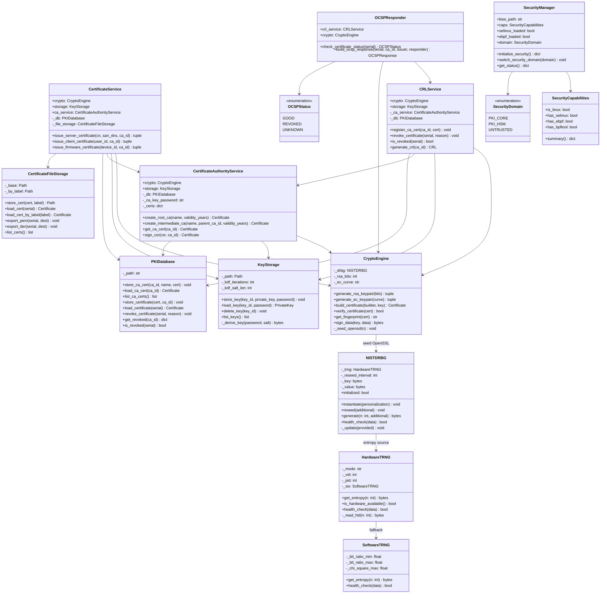

# Архитектура классов PKI-on-Box

## Предисловие: почему именно так

Когда проектируешь PKI-систему для embedded-платформы за $129, главный вопрос не «какие классы нам нужны», а «откуда берётся доверие». В коммерческих HSM доверие покупается — за $5000 ты получаешь сертифицированный чёрный ящик. Здесь доверие нужно построить из компонентов, каждый из которых по отдельности не является доверенным.

Архитектура PKI-on-Box — это цепочка, где каждый слой усиливает гарантии предыдущего. Не дерево, не граф — именно цепочка, потому что в криптографии доверие не разветвляется, оно передаётся последовательно.



---

## Слой 1: Источник энтропии — откуда берётся случайность

Вся криптография начинается с одного вопроса: есть ли у тебя настоящие случайные числа? Не псевдослучайные, не «достаточно случайные» — а физически непредсказуемые.

`HardwareTRNG` — это мост между физическим миром и программным. Внутри STM32 есть аналоговый генератор шума, который оцифровывается в 32-битные слова. Firmware (`trng_hid.c`) читает эти слова, прогоняет через два теста здоровья (TSR-1 при старте: нет ли залипания; TSR-2 непрерывно: нет ли повторов и смещения) и упаковывает в 64-байтные USB HID репорты.

На стороне хоста `HardwareTRNG` открывает HID-устройство по VID:0x0483 PID:0x5750 и читает эти репорты. Но вот ключевое решение: класс работает в трёх режимах — `hardware`, `software` и `auto`. Почему не просто hardware?

Потому что система должна работать и без STM32. Во время разработки, в CI/CD, в Docker-контейнере — USB HID недоступен. `SoftwareTRNG` — это fallback, который смешивает `os.urandom`, timestamp и PID через SHA-512. Это не аппаратная энтропия, но для тестирования достаточно. Режим `auto` пробует hardware и молча переключается на software, если устройство не найдено.

Это классический паттерн Strategy с graceful degradation. Страуструп бы одобрил — интерфейс один (`get_entropy`), а реализация адаптируется к окружению.

`NISTDRBG` — следующее звено. Сырая энтропия от TRNG непригодна для прямого использования: она медленная (15.6 КБ/с по USB) и неравномерная. HMAC_DRBG по NIST SP 800-90A принимает 32 байта энтропии как seed и генерирует криптографически стойкий поток произвольной длины. Каждые 1000 вызовов `generate()` происходит автоматический reseed — свежая порция энтропии от TRNG подмешивается в состояние.

Зачем reseed? Потому что DRBG — это детерминированный алгоритм. Если кто-то узнает внутреннее состояние (key + value), он предскажет все будущие выходы. Reseed разрывает эту цепочку — даже при компрометации состояния, через максимум 1000 вызовов оно обновится непредсказуемым образом.

## Слой 2: Криптографический движок — мост к OpenSSL

`CryptoEngine` — центральный класс, через который проходят все криптографические операции. Но он не реализует криптографию сам — он делегирует в OpenSSL через библиотеку `cryptography`. Зачем тогда отдельный класс?

Ответ в методе `_seed_openssl()`. OpenSSL имеет собственный PRNG (RAND pool), который по умолчанию использует `/dev/urandom`. На RK3328 это программный генератор ядра — приемлемый, но не аппаратный. Перед каждой генерацией ключей `CryptoEngine` вызывает `_seed_openssl(64)`: берёт 64 байта из NISTDRBG (который питается от аппаратного TRNG) и подмешивает их в OpenSSL RAND pool через `RAND_add()`.

Это тонкий, но принципиальный момент. Мы не заменяем OpenSSL PRNG — мы усиливаем его аппаратной энтропией. Даже если `/dev/urandom` окажется слабым (а на embedded-платформах с малым количеством источников энтропии это реальный риск), аппаратный TRNG компенсирует это.

`CryptoEngine` поддерживает два семейства ключей: RSA (по умолчанию 4096 бит) и EC (P-384). Выбор не случаен — RSA-4096 для CA-сертификатов (совместимость, длительный срок жизни 20 лет), EC P-384 для клиентских сертификатов (компактность, скорость на ARM64).

Отдельно стоит `run_kat()` из `self_tests.py` — шесть Known Answer Tests, которые запускаются при каждом старте системы. Это требование FIPS 140-2: перед тем как система начнёт выпускать сертификаты, она должна убедиться, что криптографические примитивы работают корректно. AES-256-GCM проверяется по NIST test vector, HMAC-SHA256 по RFC 4231 («Jefe»), SHA-256 по каноническому «abc». Если хоть один тест не проходит — `CryptoSelfTestError`, система не стартует. Никаких fallback, никаких «попробуем ещё раз». Сломанная криптография хуже отсутствующей.

## Слой 3: Хранение — где живут секреты

Три класса хранения решают три разные задачи, и важно понимать почему их три, а не один.

`KeyStorage` хранит приватные ключи. Это самые чувствительные данные в системе — компрометация ключа CA означает компрометацию всех выпущенных сертификатов. Поэтому ключи никогда не хранятся в открытом виде. При `store_key()` PEM-представление ключа шифруется AES-256-GCM, а ключ шифрования выводится из пароля через PBKDF2-HMAC-SHA256 с 260 000 итерациями и 32-байтным случайным salt.

Формат файла `.enc` намеренно простой: `[4 байта длины salt][salt][12 байт nonce][ciphertext+tag]`. Никакого ASN.1, никакого PKCS#12 — чем проще формат, тем меньше поверхность атаки для парсера.

Но самое интересное — `_zeroize()`. После каждой операции с ключом (загрузка, сохранение) открытый текст ключа затирается в памяти. Для `bytearray` — поэлементно в цикле. Для `bytes` (которые в Python иммутабельны) — через `ctypes.memset`, обращаясь напрямую к буферу объекта. Это не параноя — это стандартная практика для HSM. `delete_key()` идёт ещё дальше: перезаписывает файл нулями, вызывает `fsync` (чтобы нули дошли до диска, а не остались в кэше FS), и только потом `unlink`.

`PKIDatabase` — SQLite с тремя таблицами. Выбор SQLite осознанный: на RK3328 с 2GB RAM поднимать PostgreSQL — расточительство. Три таблицы (`ca_certificates`, `certificates`, `revoked_certificates`) отражают три состояния жизненного цикла сертификата: выпущен CA, выпущен конечный, отозван. Serial хранится как hex TEXT, а не INTEGER — потому что serial number в X.509 может быть до 20 байт, что не влезает в INT64.

`CertificateFileStorage` — дублирование? Нет. БД хранит PEM как TEXT-поле для поиска и учёта. Файловая система хранит PEM/DER для экспорта и интеграции. Индекс `by_label/` — это символические копии по человекочитаемым именам (`server.example.com.pem`), потому что искать сертификат по hex serial — занятие для машин, не для людей.

## Слой 4: Сервисы — бизнес-логика PKI

Четыре сервиса реализуют полный жизненный цикл сертификата: создание CA → выпуск → отзыв → проверка статуса.

`CertificateAuthorityService` — сердце PKI. Он управляет иерархией CA: Root CA (self-signed, RSA-4096, 20 лет) и Intermediate CA (подписан родителем, RSA-4096, pathlen=0, 10 лет). Почему pathlen=0 у Intermediate? Потому что двухуровневая иерархия — это осознанный выбор для embedded: Root CA создаётся один раз при церемонии и больше не используется для подписи конечных сертификатов. Intermediate CA подписывает всё остальное, и если он скомпрометирован — отзываем его и создаём новый, не трогая Root.

In-memory cache `_certs` — это не оптимизация, а необходимость. При каждом выпуске сертификата нужен issuer_name из CA cert. Читать его каждый раз из SQLite — медленно на ARM64. Кэш заполняется при инициализации из БД и живёт до перезапуска сервиса.

`CertificateService` выпускает три типа сертификатов, и различия между ними — не просто разные параметры, а разные модели угроз:

- Server (RSA-2048, 1 год, SERVER_AUTH) — для TLS. RSA-2048 потому что совместимость с клиентами важнее длины ключа. Год — потому что серверные сертификаты должны ротироваться часто.
- Client (EC P-384, 1 год, CLIENT_AUTH) — для аутентификации пользователей. EC потому что клиентские сертификаты часто используются на мобильных устройствах, где компактность подписи имеет значение.
- Firmware (RSA-2048, 5 лет, CODE_SIGNING) — для подписи прошивок. 5 лет потому что firmware обновляется редко, а устройство в поле может работать годами без связи с CA.

Метод `_base_builder()` — это Template Method без наследования. Общая логика (subject, issuer, serial, validity, BasicConstraints) вынесена в один метод, а каждый `issue_*` добавляет свои extensions. Это не классический GoF Template Method через наследование — это функциональная композиция, более идиоматичная для Python.

`CRLService` и `OCSPResponder` — два механизма проверки отзыва, и оба нужны. CRL (Certificate Revocation List) — это подписанный список всех отозванных сертификатов, обновляемый раз в сутки (`next_update = now + 1d`). OCSP — это онлайн-проверка конкретного serial number с ответом за 1 час. CRL для офлайн-клиентов, OCSP для онлайн. `OCSPResponder` делегирует проверку в `CRLService.is_revoked()` — единый источник истины об отзыве.

## Слой 5: Безопасность — защита от самих себя

`SecurityManager` — это не про криптографию, это про изоляцию. Даже если код PKI Core содержит уязвимость (а в 12 файлах Python это вероятно), ущерб должен быть ограничен.

Три механизма работают на разных уровнях:

SELinux (Mandatory Access Control) определяет два домена: `pki_core_t` для основного сервиса и `pki_hsm_t` для HSM/TRNG моста. Core может открывать TCP-сокеты (REST API), HSM — только Unix-сокеты и `/dev/hidraw0`. Даже если атакующий получит RCE в REST API, он окажется в домене `pki_core_t` и не сможет напрямую читать USB HID устройство.

eBPF работает на уровне ядра: network filter — whitelist портов (максимум 16), syscall monitor — аудит системных вызовов по PID. Это не блокировка, а наблюдение — но наблюдение, которое нельзя обойти из userspace.

systemd sandboxing — последний рубеж: `ProtectSystem=strict` (read-only root), `NoNewPrivileges` (нельзя повысить привилегии), `MemoryDenyWriteExecute` (нельзя создать исполняемую память — защита от shellcode).

`SecurityCapabilities` — это probe-класс, который при старте проверяет что доступно. На RK3328 с кастомным ядром 5.10 — всё. В Docker — ничего. На обычном Linux без SELinux — только eBPF и systemd. `SecurityManager.initialize_security()` загружает только то, что есть, и логирует что пропущено. Graceful degradation, не hard failure — потому что PKI должна работать и в development-окружении.

`SecurityDomain` enum определяет три уровня доступа через bitmask системных вызовов: PKI_CORE (сеть + процессы), PKI_HSM (I/O устройств), UNTRUSTED (минимум). `switch_security_domain()` одновременно переключает SELinux context и eBPF pid-to-domain map — атомарность здесь не гарантирована, но окно между двумя переключениями — микросекунды.

## Цепочка доверия: от атомов к сертификатам

```
Тепловой шум → STM32 RNG → USB HID → HardwareTRNG → NISTDRBG → CryptoEngine
                                                                      │
                                                          ┌───────────┼───────────┐
                                                          ▼           ▼           ▼
                                                    KeyStorage    CA Service   SecurityManager
                                                   (AES-GCM)    (Root/Inter)  (SELinux+eBPF)
                                                                      │
                                                              CertificateService
                                                              (Server/Client/FW)
                                                                      │
                                                              ┌───────┼───────┐
                                                              ▼               ▼
                                                          CRLService    OCSPResponder
                                                          (отзыв)      (статус)
```

Каждая стрелка — это передача доверия. Тепловой шум в кремнии STM32 — единственный источник непредсказуемости во всей системе. Всё остальное — детерминированные преобразования этой непредсказуемости в полезные криптографические артефакты.

## Метрики

| Метрика | Значение |
|---------|----------|
| Классов | 14 (+ 2 enum, 1 exception, 1 standalone function) |
| Файлов | 12 (.py) |
| Слоёв | 5 (Entropy → Crypto → Storage → Services → Security) |
| Зависимостей | 19 связей на диаграмме |
| Глубина цепочки | 5 (тепловой шум → TRNG → DRBG → CryptoEngine → CA → Certificate) |
| Стоимость платформы | ~$129 (RK3328 $111 + STM32 $18) |
