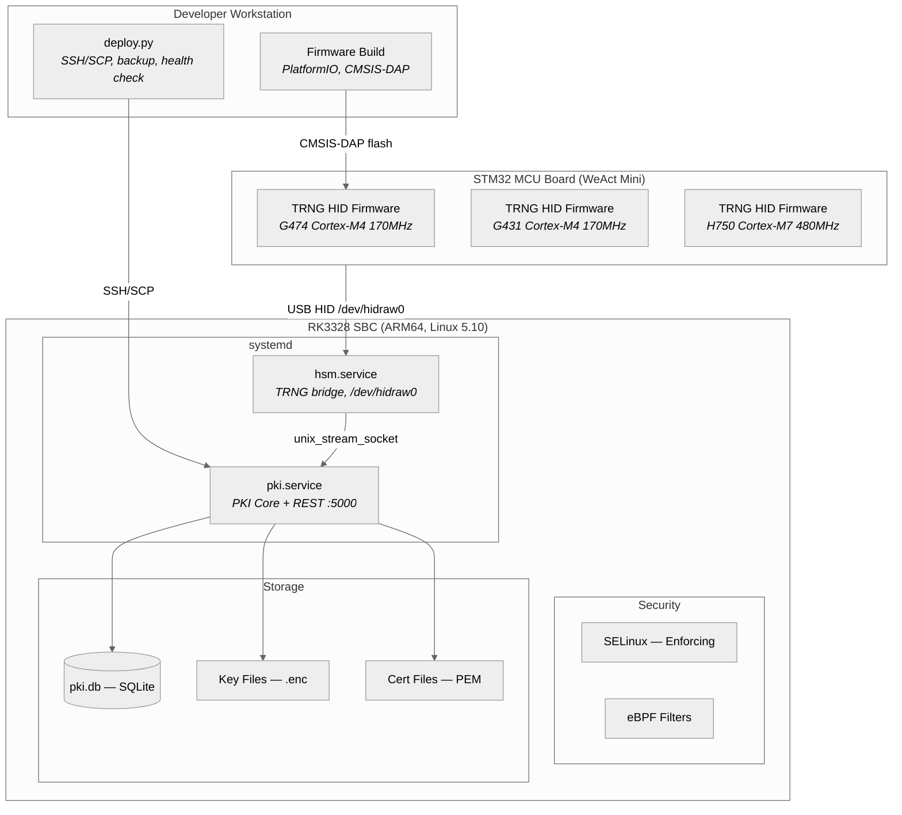

# Deployment Diagram: где живёт PKI

## Предисловие: почему железо имеет значение

Большинство PKI-систем — это софт. Установил на сервер, настроил, забыл. PKI-on-Box — это не софт. Это устройство. Два процессора (ARM Cortex-A53 и Cortex-M4), два мира (Linux и bare metal), один USB-кабель между ними. Deployment-диаграмма показывает не просто «где что запущено», а физическую реальность: какие чипы, какие шины, какие файловые системы.



---

## Три мира, один USB-кабель

На диаграмме три deployment node: Developer Workstation, STM32 MCU Board, RK3328 SBC. Это не абстракция — это три физических устройства на столе. Два из них (STM32 + RK3328) в production соединены USB-кабелем и живут в одном корпусе. Третье (Workstation) нужно только для разработки и деплоя.

Между этими мирами — пропасть. STM32 работает на bare metal, без ОС, без файловой системы, без понятия «процесс». RK3328 работает на Linux 5.10 с SELinux, systemd и Python 3.6. Workstation может быть Windows или Linux. Единственный общий язык между STM32 и RK3328 — USB HID: 64 байта данных в стандартном формате, который понимает любая ОС без драйверов.

## STM32: генератор энтропии

Три платы поддерживаются, но в production используется одна. Выбор платы — это выбор компромисса:

STM32G474CEU — основная. Cortex-M4 на 170 МГц, 512KB Flash, 128KB RAM. Избыточно для генератора случайных чисел (firmware занимает ~30KB), но запас Flash означает возможность добавить функциональность в будущем — например, аппаратный AES или SHA для ускорения криптоопераций на стороне MCU.

STM32G431CBU — бюджетная альтернатива. Тот же Cortex-M4, но 128KB Flash и 32KB RAM. Firmware влезает, но впритык. Для чистого TRNG — достаточно. Для расширения — нет.

STM32H750VBT — экзотика. Cortex-M7 на 480 МГц, 1MB RAM. Мощнее, чем нужно для TRNG, но у H7 серии — другой HAL для RNG peripheral. Поддерживается для совместимости, не для production.

Все три платы — WeAct Mini, стоимость ~$5-18. Firmware одинаковая для G4 семейства (G474 и G431 используют один бинарь), H750 — отдельная сборка из-за различий в HAL.

Прошивка через CMSIS-DAP (SWD отладчик). PlatformIO управляет сборкой и загрузкой: `pio run -e weact_g474ceu -t upload`. После прошивки MCU перезагружается, проходит startup test (TSR-1: проверка на залипание), инициализирует USB и начинает стримить энтропию.

Watchdog (IWDG) — страховка от зависания. Prescaler=64, reload=1000 — это ~4 секунды. Если main loop не обновит watchdog за 4 секунды — MCU перезагрузится. Для генератора, который должен работать месяцами без обслуживания, watchdog — не опция, а необходимость.

## RK3328: мозг системы

Firefly AIO-RK3328-JD4. Cortex-A53 (ARM64), 2GB RAM, eMMC. Стоимость ~$111. Не самый мощный одноплатник, но у него есть то, чего нет у Raspberry Pi: промышленное качество и долгосрочная доступность. Firefly гарантирует производство минимум 5 лет — для устройства, которое должно работать 10-20 лет, это важно.

Ядро — Linux 5.10, пересобранное из Rockchip BSP. Не mainline, потому что mainline не поддерживает все периферийные устройства RK3328. Кастомный defconfig включает SELinux (`CONFIG_SECURITY_SELINUX=y`), BPF (`CONFIG_BPF=y`, `CONFIG_BPF_SYSCALL=y`) и USB HID (`CONFIG_USB_HIDDEV=y`). Отдельный патч — USB2 PHY fix, без которого USB HID устройства не определяются стабильно после горячего подключения.

Python 3.6 — не выбор, а ограничение. Rockchip BSP поставляется с Python 3.6, и обновление до 3.10+ требует пересборки половины системных пакетов. Код PKI написан с учётом этого ограничения: никаких f-string walrus operator, никаких `match/case`, никаких `typing.Protocol`. `cryptography` библиотека pinned на 3.4.8 — последняя версия с поддержкой Python 3.6.

### Два сервиса, два домена

systemd управляет двумя сервисами, и их разделение — не организационное, а архитектурное.

`pki.service` — PKI Core. Python-процесс, который запускает Flask на порту 5000, обрабатывает REST API и CLI команды. Работает от пользователя `pki` (не root). `ProtectSystem=strict` делает корневую FS read-only — даже если атакующий получит RCE, он не сможет модифицировать системные файлы. `NoNewPrivileges` запрещает setuid/setgid — эскалация привилегий через бинарь невозможна. `MemoryDenyWriteExecute` — нельзя создать исполняемую память, что убивает большинство shellcode-техник.

`hsm.service` — HSM/TRNG мост. Отдельный процесс, который владеет USB HID устройством. `DeviceAllow=/dev/hidraw0 rw` — только этот сервис может читать TRNG. `RestrictAddressFamilies=AF_UNIX` — только Unix-сокеты, никакого TCP. Это значит, что HSM Service недоступен из сети — даже если eBPF фильтр обойдён, даже если SELinux скомпрометирован, TCP-стек просто не создастся.

Связь между сервисами — `unix_stream_socket`. Не TCP (лишний overhead + сетевая поверхность атаки), не shared memory (сложно контролировать доступ), не файлы (медленно). Unix socket — это IPC с контролем доступа через файловые permissions и SELinux.

### Файловая система: где что лежит

```
/opt/pki-on-box/
  app/              <- deploy target (SCP upload)
  app.prev/         <- backup (rollback)
  venv/             <- Python 3.6 virtualenv
  config.yaml       <- runtime config

/var/lib/pki/       <- pki_var_t (SELinux)
  pki.db            <- SQLite (3 tables)
  keys/             <- AES-256-GCM encrypted .enc
  certs/            <- PEM certificates
    by_label/       <- human-readable index

/var/log/pki-box/   <- pki_log_t (SELinux)
/etc/pki-box/       <- pki_config_t (SELinux)
```

Четыре директории, четыре SELinux типа, четыре уровня доступа. Приложение (`/opt/pki-on-box/app`) — read-only в runtime (обновляется только через deploy). Данные (`/var/lib/pki`) — read-write для `pki_core_t` и `pki_hsm_t`. Логи (`/var/log/pki-box`) — append-only (нельзя удалить или перезаписать старые записи). Конфиг (`/etc/pki-box`) — read-only для сервисов (изменяется только администратором).

Ключи хранятся в `/var/lib/pki/keys/` как `.enc` файлы. Каждый файл — один приватный ключ, зашифрованный AES-256-GCM. Имя файла — `{key_id}.enc`. Нет индекса, нет метаданных в имени — только ID. Метаданные — в SQLite.

Сертификаты — в `/var/lib/pki/certs/` как PEM файлы. Имя — `{serial_hex}.pem`. Индекс `by_label/` содержит копии с человекочитаемыми именами. Это не символические ссылки, а полные копии — потому что на некоторых embedded-файловых системах symlinks работают нестабильно.

## USB: самое слабое звено

USB-кабель между STM32 и RK3328 — единственный канал передачи энтропии. Если кабель отключён — система переключается на software fallback (в режиме `auto`) или останавливается (в режиме `hardware`). Если кабель подменён на устройство, имитирующее TRNG — система получит предсказуемую энтропию.

Защита от подмены — физическая: USB-кабель внутри корпуса, доступ только при вскрытии. Программная защита — health check (bit ratio + chi-square) на стороне хоста. Если подменённое устройство генерирует неслучайные данные — health check это поймает. Если генерирует «почти случайные» (например, PRNG с известным seed) — health check может не поймать. Это осознанный risk acceptance: защита от sophisticated hardware attack требует HSM за $5000, а не одноплатника за $129.

USB 2.0 Full Speed — 12 Мбит/с теоретически, ~15.6 КБ/с реально для HID. Bottleneck — не шина, а firmware: заполнение 64-байтного репорта из RNG peripheral занимает ~65ms (16 вызовов `HAL_RNG_GenerateRandomNumber()` по ~4ms каждый). Для PKI это не проблема — один reseed DRBG требует 32 байта, то есть ~2ms на чтение одного репорта.

## Deploy: четыре шага, один rollback

```
Developer                          RK3328
   |                                 |
   |  [1] backup: cp -a app -> app.prev
   |  [2] upload: scp -r ./app -> /opt/pki-on-box/app
   |  [3] restart: systemctl restart pki.service
   |  [4] health: curl http://127.0.0.1:5000/health
   |                                 |
   |  healthy -> done                |
   |  failed  -> rollback:           |
   |     mv app.prev -> app          |
   |     systemctl restart pki       |
```

Deploy намеренно примитивен. Никакого Ansible, никакого Kubernetes, никакого blue-green. Четыре команды по SSH: backup, upload, restart, health check. Если health check не проходит — автоматический rollback: предыдущая версия восстанавливается из `app.prev`, сервис перезапускается.

Почему так просто? Потому что на одноплатнике с 2GB RAM сложность деплоя — это сложность отладки. Если Ansible playbook сломается на шаге 47 из 50 — восстановление потребует понимания всех 50 шагов. Если `deploy.py` сломается на шаге 3 из 4 — восстановление очевидно: `mv app.prev app && systemctl restart pki`.

Health check — `GET /api/v1/health`. Если Flask отвечает `{"status": "ok"}` — значит, приложение запустилось, KAT прошли, TRNG инициализирован, БД доступна. Один endpoint проверяет всю цепочку.

## Стоимость: $129 за PKI

| Компонент | Стоимость |
|-----------|----------|
| Firefly AIO-RK3328-JD4 | ~$111 |
| WeAct STM32G474CEU Mini | ~$18 |
| USB-кабель | ~$0 (в комплекте) |
| Корпус | ~$0 (3D-печать) |
| Итого | ~$129 |

Для сравнения: Thales Luna Network HSM — от $15,000. AWS CloudHSM — $1.60/час ($14,000/год). YubiHSM 2 — $650 (но без PKI софта).

$129 — это не конкурент Thales. Это ответ на вопрос: «можно ли построить PKI с аппаратным TRNG за стоимость обеда в ресторане?» Ответ — да, если принять ограничения: Python 3.6, 15.6 КБ/с энтропии, один сертификат за 1.6 секунды. Для IoT-фермы из 1000 устройств, которым нужны сертификаты раз в год — более чем достаточно.