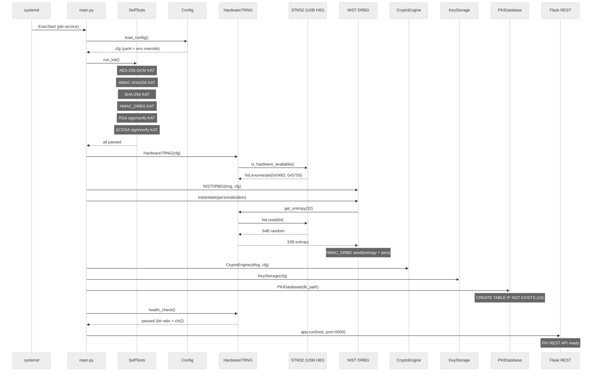
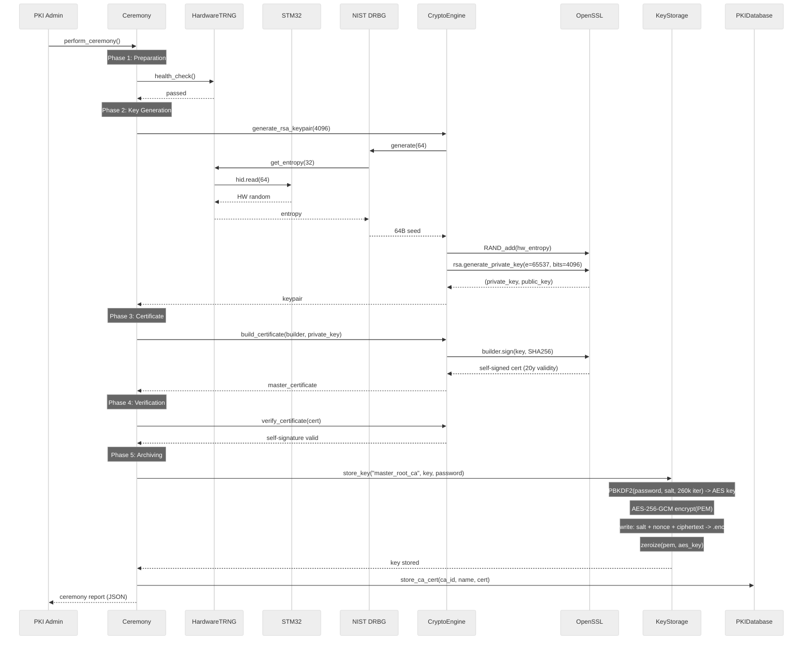
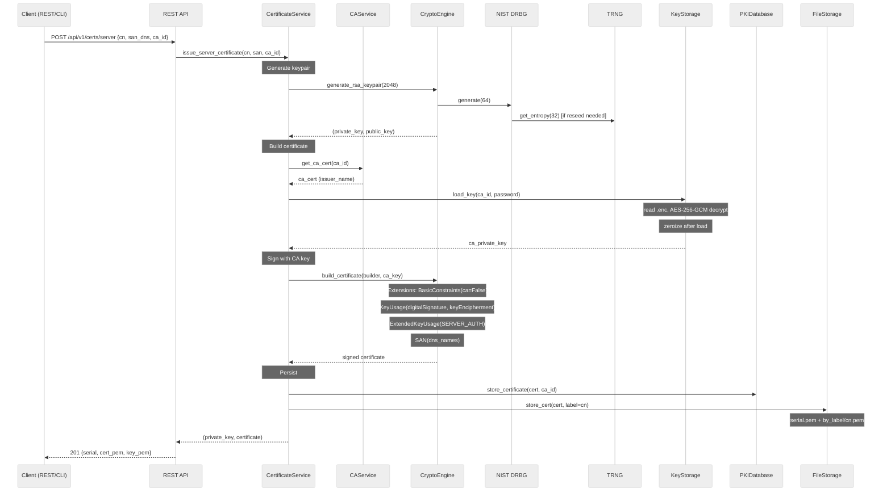
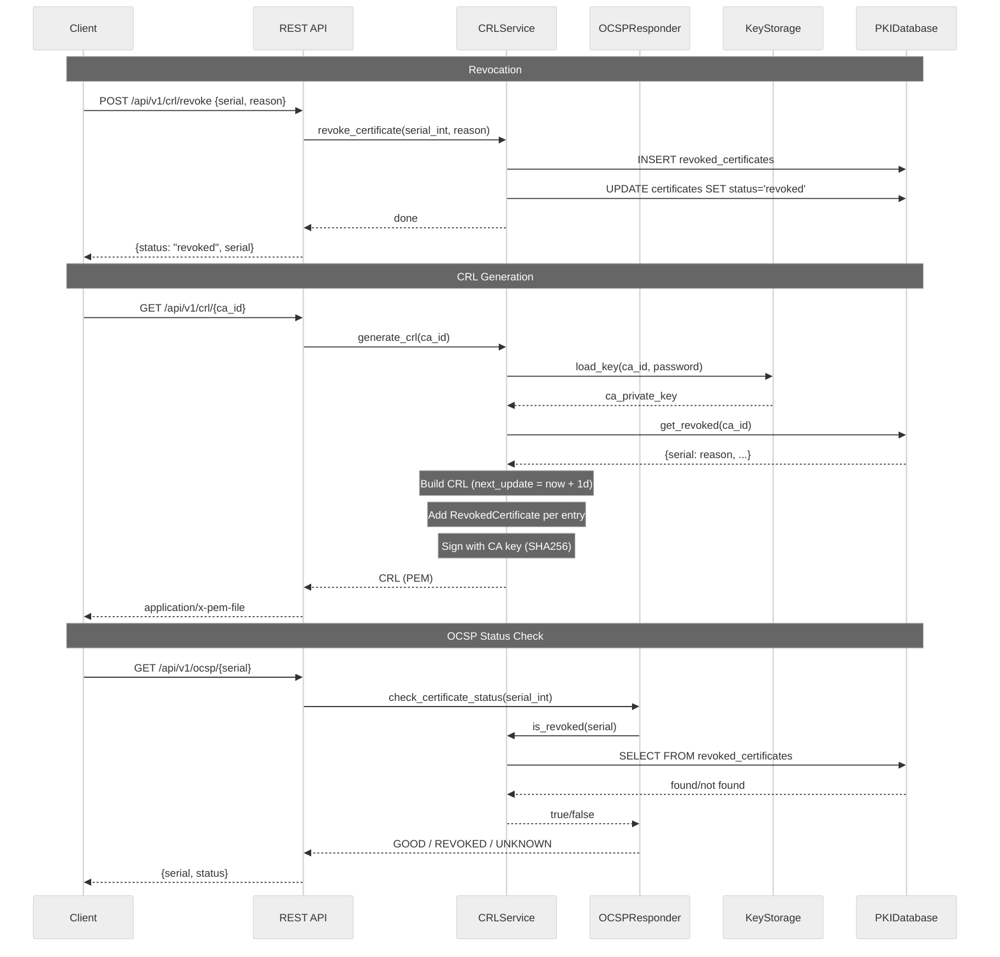
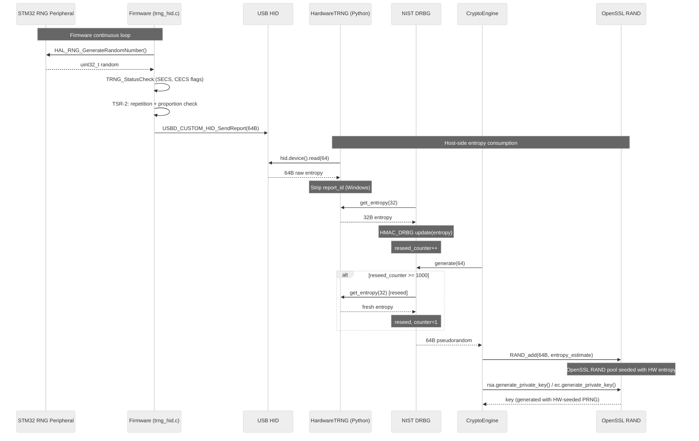

# Sequence Diagrams: пять историй одной системы

## Предисловие: зачем пять диаграмм

Sequence-диаграмма — это рассказ о времени. Не о структуре (это Class), не о размещении (это Deployment) — а о том, что происходит первым, что вторым, и почему именно в таком порядке.

У PKI-on-Box пять ключевых сценариев, и каждый из них — отдельная история со своей драматургией. Startup — это история о доверии к самому себе. Ceremony — о создании корня доверия. Issuance — о конвейере. Revocation — о том, как отменить то, что уже выпущено. Entropy Chain — о физике, которая стоит за всей криптографией.

---

## 1. System Startup — история о доверии к самому себе

Когда systemd запускает `pki.service`, система ещё не знает, можно ли ей доверять. Может быть, бинарь OpenSSL повреждён. Может быть, STM32 отключён. Может быть, база данных пуста. Startup — это последовательность проверок, где каждый следующий шаг возможен только если предыдущий прошёл успешно.

Первое, что делает система — загружает конфигурацию. Не создаёт объекты, не открывает соединения — читает YAML. Это важно: если конфиг невалиден, система падает сразу, с понятной ошибкой, а не через 30 секунд при первом запросе.

Второй шаг — Known Answer Tests. Шесть тестов, каждый проверяет конкретный криптографический примитив по эталонному вектору. AES-256-GCM — по NIST test vector. HMAC-SHA256 — по RFC 4231 (знаменитый ключ "Jefe" и сообщение "what do ya want for nothing?"). SHA-256 — каноническое "abc". Если хоть один тест не проходит — `CryptoSelfTestError`, процесс завершается. Никаких retry, никаких fallback. Сломанная криптография опаснее отсутствующей — она создаёт иллюзию безопасности.

Почему KAT запускаются до инициализации TRNG? Потому что DRBG использует HMAC-SHA256, а CryptoEngine использует OpenSSL. Если эти примитивы не работают — нет смысла инициализировать генератор случайных чисел, который на них опирается.

Третий шаг — инициализация цепочки энтропии. `HardwareTRNG` проверяет наличие USB HID устройства (`hid.enumerate`). `NISTDRBG` запрашивает 32 байта энтропии для первичного seed. Это первое обращение к STM32 — первые 64 байта аппаратного шума, которые станут основой для всех будущих ключей.

Четвёртый шаг — создание остальных компонентов: CryptoEngine, KeyStorage, PKIDatabase. SQLite создаёт таблицы если их нет (`CREATE TABLE IF NOT EXISTS`) — это делает первый запуск идемпотентным.

Пятый шаг — health check TRNG. Не при инициализации, а после неё. Почему? Потому что `instantiate()` уже использовал энтропию — если TRNG был сломан, DRBG получил плохой seed. Health check после инициализации — это проверка того, что seed был качественным. Bit ratio (0.40-0.60) и chi-square (не более 310) — два статистических теста на 2048 байтах.

И только после всех проверок — `app.run()`. Flask начинает слушать порт 5000. Система готова.

Весь startup занимает ~3 секунды на RK3328. Из них ~1.5 секунды — KAT (генерация RSA-2048 и EC P-384 ключей для тестов sign/verify). Это цена, которую мы платим за уверенность.

---

## 2. Root CA Ceremony — рождение корня доверия

Церемония создания Root CA — самый важный момент в жизни PKI. Всё, что система когда-либо выпустит — каждый сертификат, каждый CRL, каждый OCSP-ответ — будет прямо или косвенно подписано ключом, который создаётся сейчас. Если этот ключ слаб — вся PKI бессмысленна. Если он скомпрометирован — вся PKI мертва.

Поэтому церемония — это не просто вызов API. Это ритуал с пятью фазами, каждая из которых может прервать процесс.

Phase 1: Preparation. Прежде чем генерировать ключ, церемония проверяет здоровье TRNG. Это не формальность — это gate. Если STM32 отключён, если USB-кабель отошёл, если firmware зависла — health check это поймает. Генерировать Root CA ключ на программном fallback (`os.urandom`) — недопустимо. Для обычных сертификатов — может быть. Для Root CA — нет.

Phase 2: Key Generation. RSA-4096, не 2048. Для Root CA, который будет жить 20 лет, 4096 бит — это минимум. NIST рекомендует RSA-2048 до 2030 года, но Root CA создаётся сейчас и должен быть валиден до 2046. К тому времени квантовые компьютеры могут сделать RSA-2048 уязвимым — RSA-4096 даёт запас.

Обратите внимание на цепочку: CryptoEngine просит 64 байта у DRBG, DRBG просит 32 байта энтропии у TRNG (если пришло время reseed), TRNG читает 64 байта с USB HID от STM32. Три уровня indirection между физическим шумом и OpenSSL. Каждый уровень добавляет свои гарантии: TRNG — health check, DRBG — криптографическое расширение, CryptoEngine — подмешивание в OpenSSL RAND pool.

`RAND_add(hw_entropy)` — ключевой момент. OpenSSL не заменяет свой PRNG на наш — он подмешивает нашу энтропию в свой пул. Это значит, что даже если наш TRNG окажется слабым (что health check должен предотвратить), OpenSSL PRNG не станет хуже — он станет как минимум таким же хорошим, как `/dev/urandom`. А если TRNG работает правильно — значительно лучше.

Phase 3: Certificate. Self-signed сертификат с `BasicConstraints(ca=True, pathlen=None)`. `pathlen=None` означает неограниченную глубину цепочки — Root CA может подписывать Intermediate CA, которые могут подписывать другие Intermediate. На практике мы используем только один уровень (pathlen=0 у Intermediate), но Root не ограничивает это — на случай, если через 10 лет понадобится трёхуровневая иерархия.

Validity 20 лет — это не произвольное число. Это компромисс между безопасностью (чем короче — тем лучше) и практичностью (замена Root CA — это катастрофа, требующая перевыпуска всех сертификатов). 20 лет — стандарт индустрии для offline Root CA.

Phase 4: Verification. Церемония проверяет только что созданный сертификат — `verify_certificate()` валидирует self-signature. Это может показаться избыточным: мы только что подписали сертификат, зачем проверять? Потому что между подписанием и проверкой — OpenSSL. Если в OpenSSL баг (а они бывают — вспомните Heartbleed), подпись может быть невалидной. Лучше узнать об этом сейчас, чем через год, когда клиент не сможет верифицировать цепочку.

Phase 5: Archiving. Приватный ключ шифруется и сохраняется. PBKDF2 с 260 000 итерациями — это ~0.5 секунды на RK3328. Для атакующего, перебирающего пароли — 260 000 хешей на каждую попытку. AES-256-GCM обеспечивает и конфиденциальность, и целостность — если файл `.enc` будет повреждён, расшифровка не вернёт мусор, а выбросит исключение.

И последнее: `zeroize(pem, aes_key)`. После того как ключ зашифрован и записан на диск, его открытое представление затирается в памяти. PEM-байты, AES-ключ — всё обнуляется. Это защита от cold boot attack и memory dump. Ключ Root CA существует в открытом виде только в момент генерации и подписания — секунды, не минуты.

---

## 3. Certificate Issuance — конвейер доверия

Если церемония — это рождение, то выпуск сертификата — это конвейер. Каждый запрос проходит один и тот же путь: генерация ключей, сборка сертификата, подпись CA, сохранение. Но за этой механичностью скрываются решения, которые определяют безопасность каждого выпущенного сертификата.

Запрос приходит как JSON: `{cn: "server.example.com", san_dns: ["server.example.com", "*.example.com"], ca_id: "ca_intermediate_1"}`. Три поля — и каждое критично.

`cn` (Common Name) — устаревшее поле, которое всё ещё требуется для совместимости. Современные браузеры игнорируют CN и смотрят только на SAN, но старые клиенты (curl без флага `--connect-to`, Java 6, embedded-устройства с древним OpenSSL) всё ещё проверяют CN.

`san_dns` — Subject Alternative Name, реальный идентификатор сервера. Wildcard (`*.example.com`) поддерживается, но только на один уровень — `*.sub.example.com` не покроет `deep.sub.example.com`. Это ограничение X.509, не наше.

`ca_id` — какой CA подписывает. Обычно это Intermediate CA, не Root. Root CA ключ расшифровывается только при создании Intermediate — для рутинных операций он не нужен.

Генерация ключей — RSA-2048 для серверных сертификатов. Не 4096, как у CA. Почему? Потому что серверный сертификат живёт 1 год и используется в TLS handshake. На RK3328 TLS handshake с RSA-4096 занимает ~800ms, с RSA-2048 — ~200ms. Для сервера, обрабатывающего десятки подключений — разница существенная. А через год сертификат всё равно перевыпускается.

Загрузка CA ключа — самый чувствительный момент. `KeyStorage.load_key()` расшифровывает `.enc` файл (AES-256-GCM), возвращает приватный ключ и немедленно затирает промежуточные буферы. CA ключ существует в памяти ровно столько, сколько нужно для подписи — потом он снова только на диске, зашифрованный.

`get_ca_cert()` — обращение к in-memory cache, не к БД. Это ~0.001ms вместо ~5ms. При batch-выпуске 100 сертификатов — 0.1ms вместо 500ms.

Подпись — `builder.sign(ca_key, SHA256)`. Одна строка кода, но за ней — вся цепочка доверия. Этот вызов создаёт математическую связь между CA и новым сертификатом. Любой, кто имеет публичный ключ CA, может верифицировать эту связь. Никто, кроме владельца приватного ключа CA, не может её создать.

Extensions — не декорация, а юридический документ:
- `BasicConstraints(ca=False)` — этот сертификат не может подписывать другие сертификаты. Без этого ограничения владелец серверного сертификата мог бы выпускать свои собственные сертификаты.
- `KeyUsage(digitalSignature, keyEncipherment)` — ключ можно использовать для TLS (подпись + обмен ключами), но не для подписи кода или CRL.
- `ExtendedKeyUsage(SERVER_AUTH)` — только для серверной аутентификации. Клиент, проверяющий сертификат, убедится что он предназначен именно для TLS-сервера.
- `SAN` — список DNS-имён, для которых сертификат валиден.

Сохранение — двойное. SQLite получает метаданные (serial, CN, CA ID, даты, статус). FileStorage получает PEM-файл и создаёт копию в `by_label/`. Два хранилища, два назначения: БД для поиска и учёта, файлы для экспорта.

Ответ клиенту — `201 Created` с PEM сертификата и PEM приватного ключа. Да, приватный ключ возвращается клиенту. Это осознанное решение: ключ генерируется на стороне PKI (не клиента), потому что PKI имеет аппаратный TRNG. Клиент может не иметь качественного источника энтропии. Передача ключа по сети — риск, но он митигируется сетевой изоляцией (eBPF + SELinux).

---

## 4. Revocation + CRL + OCSP — как отменить доверие

Выпустить сертификат — просто. Отозвать — сложнее. Проблема в том, что сертификат — это автономный документ. Он содержит всё необходимое для верификации: публичный ключ, подпись CA, срок действия. Клиент может проверить сертификат без обращения к CA. Это преимущество (offline verification), но и проблема: как сообщить клиенту, что сертификат отозван, если клиент не обязан спрашивать?

Два механизма — CRL и OCSP — решают эту проблему по-разному.

Отзыв — это два SQL-запроса. `INSERT INTO revoked_certificates` — добавить serial и причину отзыва. `UPDATE certificates SET status='revoked'` — пометить сертификат в основной таблице. Два запроса, не один, потому что это две разные сущности: факт отзыва (revoked_certificates) и статус сертификата (certificates). CRL генерируется из первой таблицы, поиск сертификатов — из второй.

Причина отзыва (`reason`) — не просто комментарий. X.509 определяет конкретные значения: `keyCompromise`, `cACompromise`, `affiliationChanged`, `superseded`, `cessationOfOperation`. Каждое значение имеет юридический смысл. `keyCompromise` означает, что приватный ключ мог быть раскрыт — клиенты должны немедленно прекратить доверять этому сертификату. `superseded` означает, что выпущен новый сертификат — менее срочно.

CRL Generation — самая тяжёлая операция. Нужно загрузить CA ключ (расшифровать `.enc`), получить все отозванные сертификаты для этого CA, построить CRL и подписать его. `next_update = now + 1 день` — это обещание: «в течение следующих 24 часов этот CRL актуален». Клиент, получивший CRL, может кэшировать его на сутки и не запрашивать повторно.

Почему 1 день, а не 1 час? Потому что CRL — это документ для офлайн-клиентов. Устройство в поле может проверять CRL раз в сутки при синхронизации. Если `next_update` — 1 час, устройство будет считать CRL устаревшим 23 часа из 24. Сутки — разумный компромисс.

OCSP — онлайн-альтернатива. Клиент спрашивает: «serial 0xa3f7b2c1 — отозван?» Ответ: GOOD, REVOKED или UNKNOWN. Ответ валиден 1 час (`next_update = now + 1h`) — короче, чем CRL, потому что OCSP предполагает онлайн-доступ.

Архитектурно важно: `OCSPResponder` не имеет собственного хранилища отозванных сертификатов. Он делегирует проверку в `CRLService.is_revoked()`, который обращается к SQLite. Единый источник истины — таблица `revoked_certificates`. Это исключает рассинхронизацию между CRL и OCSP: если сертификат отозван — оба механизма это увидят одновременно.

Три статуса OCSP — три разных ситуации:
- GOOD — сертификат не отозван и известен системе. Это не гарантия валидности (сертификат может быть просрочен) — только подтверждение, что он не отозван.
- REVOKED — сертификат явно отозван. Ответ включает время отзыва и причину.
- UNKNOWN — serial не найден в системе. Это может означать, что сертификат выпущен другим CA, или что serial невалиден. UNKNOWN — не ошибка, а честный ответ: «я не знаю этот сертификат».

---

## 5. Entropy Chain — от теплового шума к приватному ключу

Это самая глубокая диаграмма — она показывает путь от физического явления (тепловой шум в кремнии) до математического артефакта (приватный ключ RSA). Шесть участников, три границы (firmware / USB / host), и ни одного места, где можно срезать путь.

Всё начинается в кремнии. STM32 RNG peripheral — это аналоговый генератор шума, встроенный в микроконтроллер. Он использует тепловой шум в полупроводниковых переходах — физический процесс, который невозможно предсказать даже теоретически (это следствие квантовой механики, не алгоритмической сложности). Шум оцифровывается в 32-битные слова через АЦП.

Firmware читает эти слова через HAL: `HAL_RNG_GenerateRandomNumber()`. Но не доверяет им слепо. Два уровня проверки:

Первый — аппаратные флаги. `SECS` (Seed Error Current Status) означает, что seed для внутреннего кондиционера RNG не прошёл проверку. `CECS` (Clock Error Current Status) означает, что тактовый генератор RNG работает нестабильно. Любой из этих флагов — это `ERR_RNG_SECS` или `ERR_RNG_CECS`, SOS-мигание, halt. Firmware не пытается восстановиться — если аппаратура сломана, программа не может это исправить.

Второй — программные тесты (TSR-2, continuous). Repetition test: если два последовательных 32-битных слова идентичны — `ERR_TSR2_REP`. Вероятность случайного совпадения — 1/2^32, то есть ~2.3 * 10^-10. Если это произошло — генератор, скорее всего, залип. Proportion test: если MSB (старший бит) четырёх последовательных слов одинаков — `ERR_TSR2_PROP`. Вероятность — 1/16, но четыре подряд — это паттерн, которого быть не должно.

Прошедшие проверку слова упаковываются в 64-байтный USB HID репорт и отправляются хосту. Скорость — ~15.6 КБ/с. Это не быстро (для сравнения, `/dev/urandom` даёт ~100 МБ/с), но это настоящая аппаратная энтропия, а не PRNG.

На стороне хоста `HardwareTRNG` читает репорты через `hidapi`. Тонкость: на Windows USB HID prepend report_id (0x00) к данным, на Linux — нет. Поэтому `_read_hid()` проверяет `sys.platform` и strip первый байт на Windows. Мелочь, но без неё — 63 байта энтропии вместо 64, и первый байт всегда 0x00.

`NISTDRBG` потребляет энтропию порциями по 32 байта. Не 64 (размер репорта), не 16 (минимум для HMAC-SHA256) — именно 32. Это seed size, рекомендованный NIST SP 800-90A для HMAC_DRBG с SHA-256: security strength 256 бит требует seed не менее 256 бит = 32 байта.

DRBG — это усилитель. Из 32 байт энтропии он генерирует произвольное количество криптографически стойких псевдослучайных байт. Но «псевдослучайных» — ключевое слово. DRBG детерминирован: зная внутреннее состояние (key + value), можно предсказать все будущие выходы. Поэтому reseed каждые 1000 вызовов: свежие 32 байта от TRNG обновляют состояние, разрывая цепочку предсказуемости.

Почему 1000, а не 100 или 10000? Компромисс. Каждый reseed — это обращение к USB HID (~4ms). При 100 — слишком часто, замедляет batch-операции. При 10000 — слишком редко, окно предсказуемости растёт. 1000 — это ~4 секунды USB-задержки на 1000 генераций ключей, что приемлемо.

`CryptoEngine._seed_openssl(64)` — финальный шаг перед генерацией ключа. 64 байта из DRBG подмешиваются в OpenSSL RAND pool. `RAND_add(data, len, entropy_estimate)` — третий параметр (`entropy_estimate`) говорит OpenSSL, сколько бит энтропии содержат эти данные. Мы передаём `float(len(data))` — то есть заявляем, что каждый байт содержит 8 бит энтропии. Это оптимистичная оценка (реальная энтропия после DRBG — ~7.99 бит/байт по NIST тестам), но OpenSSL использует её только для внутреннего учёта, не для криптографических решений.

И наконец — `rsa.generate_private_key()` или `ec.generate_private_key()`. OpenSSL генерирует ключ, используя свой RAND pool, который теперь содержит аппаратную энтропию. Ключ готов.

Весь путь: тепловой шум → АЦП → firmware health check → USB HID → Python HID read → DRBG seed → DRBG generate → OpenSSL RAND_add → OpenSSL keygen. Девять шагов, три границы (кремний / USB / software), два уровня health check (firmware TSR + host chi-square). И на каждом шаге — возможность остановиться, если что-то не так.

---

## Эпилог: время как архитектурный элемент

Sequence-диаграммы показывают то, что не видно на Class или Container: порядок имеет значение. KAT до TRNG. Health check после instantiate. Zeroize после store. Verify после sign.

Каждый из этих порядков — не случайность, а решение. И каждое решение — ответ на вопрос: «что произойдёт, если этот шаг пропустить?»

- Пропустить KAT → сломанный OpenSSL генерирует слабые ключи, никто не замечает.
- Пропустить health check → TRNG с залипшим битом даёт предсказуемый seed.
- Пропустить zeroize → приватный ключ CA остаётся в памяти, доступен через memory dump.
- Пропустить verify → невалидный Root CA сертификат, вся цепочка не верифицируется.

Время в криптографии — это не оптимизация. Это безопасность.